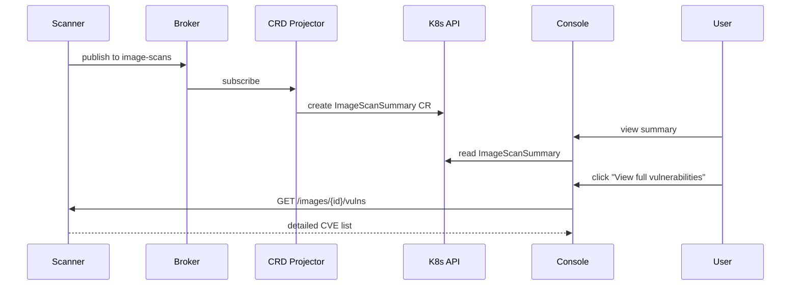
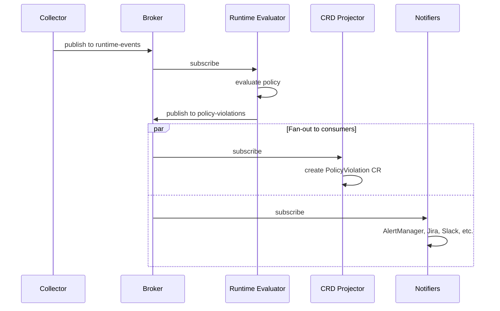
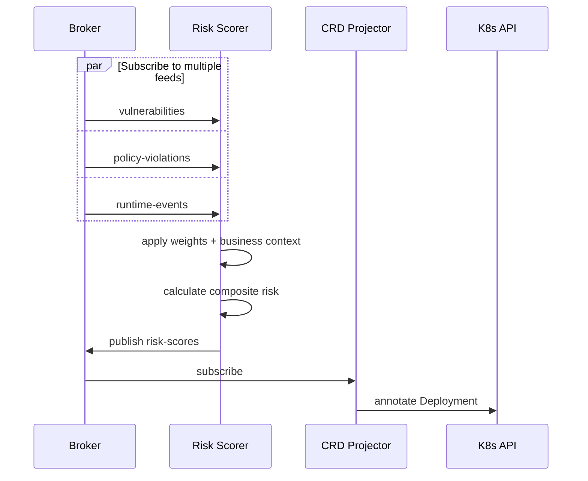

# ACS Next: Architecture Overview

*Status: Draft | Date: 2026-03-12*

---

## Overview

ACS Next is a single-cluster security platform built on an **event-driven architecture**. At its core is an **Event Hub** — an embedded pub/sub broker that aggregates all security data streams and allows consumers to subscribe to feeds of interest.

This design enables:
* **Decoupled components**: Producers and consumers evolve independently
* **Flexible deployment**: Users choose which consumers to run based on their needs
* **Minimal footprint option**: CRD-only deployment without any custom persistent API
* **Extensibility**: New consumers can be added without modifying core components

---

## Document Structure

This architecture is split across focused documents:

| Document | Content |
|----------|---------|
| **README.md** (this file) | Overview, core diagram, component summaries, data flows, design decisions |
| [components/scanner.md](components/scanner.md) | Scanner indexer/matcher architecture, deployment topologies |
| [components/broker.md](components/broker.md) | Broker/NATS implementation, JetStream, feeds, recovery |
| [components/policy-engine.md](components/policy-engine.md) | Policy engine options, embedded vs separate, signature verification |
| [components/consumers.md](components/consumers.md) | CRD Projector, Alerting, Notifiers, Risk Scorer, Baselines |
| [data-architecture.md](data-architecture.md) | Persistence strategy, CRD scaling, Prometheus metrics, exception workflow |
| [multi-cluster.md](multi-cluster.md) | Vuln Management Service, Fleet RBAC, Reporting, ACM integration |
| [deployment.md](deployment.md) | Deployment profiles, topologies, installation/operator |
| [crds.md](crds.md) | Full CRD reference (schemas, examples, inventory) |

---

## Core Architecture

```
┌───────────────────────────────────────────────────────────────────────────────────────┐
│                               ACS Next (per cluster)                                  │
│                                                                                       │
│  SOURCES (raw data + embedded policy engine)                                          │
│  ┌───────────────┐ ┌───────────────┐ ┌───────────────┐ ┌───────────────┐              │
│  │   Collector   │ │   Admission   │ │  Audit Logs   │ │    Scanner    │              │
│  │    (eBPF)     │ │    Control    │ │               │ │  (+roxctl EP) │              │
│  │ runtime phase │ │ deploy phase  │ │               │ │  build phase  │              │
│  └───────┬───────┘ └───────┬───────┘ └───────┬───────┘ └───────┬───────┘              │
│          │                 │                 │                 │                      │
│          ▼                 ▼                 ▼                 ▼                      │
│  ┌─────────────────────────────────────────────────────────────────────────────────┐  │
│  │                       ACS BROKER (embedded NATS)                                │  │
│  │                   (NATS protocol / mTLS for external)                           │  │
│  │                                                                                 │  │
│  │  Feeds:  acs.*.runtime-events | acs.*.process-events | acs.*.network-flows     │  │
│  │          acs.*.admission-events | acs.*.audit-events | acs.*.image-scans       │  │
│  │          acs.*.vulnerabilities | acs.*.policy-violations | acs.*.node-index    │  │
│  └─────────────────────────────────────────────────────────────────────────────────┘  │
│          │                 │                 │                 │                │     │
│          │ internal subscribers              │                 │                │     │
│          ▼                 ▼                 ▼                 ▼                │     │
│  ┌─────────────┐ ┌─────────────┐ ┌─────────────┐ ┌─────────────┐ ┌───────────┐  │     │
│  │  Alerting   │ │  External   │ │    Risk     │ │ Baselines   │ │    CRD    │  │     │
│  │   Service   │ │  Notifiers  │ │   Scorer    │ │             │ │ Projector │  │     │
│  │(AlertMgr)   │ │(Jira,Splunk)│ │             │ │             │ │(summaries)│  │     │
│  └─────────────┘ └─────────────┘ └─────────────┘ └─────────────┘ └───────────┘  │     │
│                                                                                 │     │
└─────────────────────────────────────────────────────────────────────────────────┼─────┘
                                                                                  │
                                                           mTLS (external subscription)
                                                                                  │
                                                                                  ▼
┌───────────────────────────────────────────────────────────────────────────────────────┐
│                          OPP Portfolio (currently ACM)                                │
│                                                                                       │
│  ┌─────────────────────────────────────────────────────────────────────────────────┐  │
│  │                    Vuln Management Service (hub)                                 │  │
│  │   • Subscribes directly to Broker feeds from all managed clusters              │  │
│  │   • Aggregates vulnerability data fleet-wide                                   │  │
│  │   • Provides fleet-level query API (cluster-scoped RBAC)                       │  │
│  │   • Feeds OCP Console multi-cluster perspective                                │  │
│  └─────────────────────────────────────────────────────────────────────────────────┘  │
│                                                                                       │
│  • ACM Governance distributes policy CRDs to clusters                                │
│  • OCP Console provides multi-cluster security views                                 │
└───────────────────────────────────────────────────────────────────────────────────────┘
```

---

## Components

### Broker (Event Hub)

The central hub connecting all components. All raw data sources publish to the broker; all consumers subscribe from the broker. This avoids direct component-to-component connections.

See [Broker documentation](components/broker.md) for implementation details.

---

### Sources of Raw Data

These components generate security data and publish to the broker.

| Source | Purpose | Publishes to | Deployment |
|--------|---------|--------------|------------|
| **Collector** | eBPF runtime data + node indexing | `runtime-events`, `process-events`, `network-flows`, `node-index` | DaemonSet |
| **Admission Control** | Deploy-time validation webhook | `admission-events`, `policy-violations` | Deployment (HA) |
| **Audit Logs** | Control plane audit collection | `audit-events` | DaemonSet |
| **[Scanner](components/scanner.md)** | Image vuln scanning, SBOM | `image-scans`, `vulnerabilities`, `sbom-updates` | Flexible (split indexer/matcher) |

All sources except Audit Logs embed the policy engine for their respective lifecycle phase (runtime, deploy, build).

---

### Consumers

Consumers subscribe to broker feeds and perform actions. Users choose which consumers to deploy based on their needs.

| Consumer | Purpose | Consumes from | Deployment |
|----------|---------|---------------|------------|
| **CRD Projector** | Projects summary CRs for OCP Console | `policy-violations`, `image-scans` | Deployment |
| **Notifiers** | AlertManager, Jira, Splunk, Slack, SIEM | `policy-violations`, `vulnerabilities` | Deployment |
| **Risk Scorer** | Composite risk scores | `vulnerabilities`, `policy-violations`, `runtime-events` | Deployment |
| **Baselines** | Learns behavior, detects anomalies | `runtime-events`, `network-flows`, `process-events` | Deployment |
| **[Vuln Management Service](multi-cluster.md)** | Fleet-wide queries and reporting | `image-scans`, `vulnerabilities` (via NATS leaf) | Deployment |

See [Consumers documentation](components/consumers.md) for details.

---

## Data Flow Examples

### Example 1: Image Scan → Summary CR + Console Drill-Down



### Example 2: Runtime Event → Policy Violation → Alert



### Example 3: Risk Calculation



---

## Key Design Decisions

### Why Event Hub instead of direct storage?

With direct storage, producers are coupled to persistence — they write to a database, and that's the only consumer. Adding new consumers means modifying producers or building replication pipelines.

With an Event Hub, producers publish events without caring who consumes them. Multiple consumers can subscribe to the same feeds for different purposes: one creates CRs, another sends alerts, a third aggregates for fleet queries. New consumers subscribe to existing feeds without touching producers. Each consumer chooses its own persistence strategy — or none at all.

### Why embedded broker instead of external?

* **Footprint**: No additional infrastructure to deploy
* **Operational simplicity**: One less thing to manage
* **Latency**: In-process communication is faster
* **Trade-off**: Limited to single-cluster scale (which is the ACS Next model)

### Multiple ways to expose results

The broker is the source of truth, but there are multiple ways to expose security data to users and external systems:

* **CRs** — CRD Projector subscribes to broker feeds and creates summary CRs (PolicyViolation, ImageScanSummary). Good for OCP Console visibility and K8s RBAC.
* **Broker topics** — External systems subscribe directly via NATS. Good for fleet aggregation (Vuln Management Service) or streaming to custom tooling.
* **REST API** — Vuln Management Service provides a query API backed by SQLite/PostgreSQL. Good for fleet-wide queries and reporting.
* **Annotations** — Components annotate existing resources (e.g., Deployments with risk scores). Good for surfacing data in existing workflows.
* **Prometheus metrics** — Components expose metrics for trends and alerting. Good for dashboards and threshold-based alerts.

Users choose which exposure mechanisms make sense for their deployment. A standalone cluster might use CRs + Prometheus. A fleet deployment might skip CRs entirely and use direct broker subscription + Vuln Management Service API.

### Per-cluster persistence is a choice, not a requirement

Different use cases can be served by different mechanisms — a dedicated per-cluster database is one option, not the only option:

| Use Case | Options |
|----------|---------|
| Vulnerability trends | Prometheus metrics + OCP dashboards, or Vuln Management Service |
| Event history | Notifiers to customer SIEM, or Vuln Management Service |
| CVE drill-down | Scanner's per-image API, or Vuln Management Service |
| Cross-namespace queries | Prometheus metrics, PolicyViolation CRs, or Vuln Management Service |
| Fleet-level queries | Vuln Management Service |

A standalone cluster needing historical queries could deploy the Vuln Management Service locally. A fleet deployment centralizes this on the hub. A minimal deployment uses only Prometheus and Scanner APIs. See [Data Architecture](data-architecture.md) for details.

### Feature Development Pattern

ACS Next establishes a repeatable pattern for adding new capabilities:
**subscribe to existing broker feeds, produce new CRs.**

```
Existing broker feeds (process-events, image-scans, violations, etc.)
    │
    v
New Consumer (subscribes to relevant feeds)
    ├── Reads additional data sources if needed (Scanner API, CRDs, etc.)
    ├── Computes new insights
    └── Produces new CRs (namespace-scoped, K8s RBAC)
        │
        v
    OCP Console displays new CRs natively
    Vuln Management Service aggregates at fleet level (if applicable)
```

**Properties of this pattern:**

* **No modification to existing components** — new features don't touch Scanner, Collector, or the policy engine
* **Independent ownership** — a separate team can build, test, and release a new consumer
* **Natural product tiering** — deploy the component for OPP customers, omit it for OCP-only
* **OCP Console integration for free** — CRs appear in the Console via standard K8s API

### Stateful vs Stateless Components

**Principle: only components whose primary function is data persistence get PVCs. Everything else is stateless and replays from the broker on restart.**

Stateful components (have PVCs):

| Component | What it persists | Why |
|---|---|---|
| Broker | Event streams (JetStream) | Recovery source for all consumers |
| Scanner | Vulnerability database | Core function — indexing and matching |
| Vuln Management Service | Fleet-wide scan results | Core function — fleet queries and reporting |

Stateless components (no PVCs):
* CRD Projector, Notifiers, Runtime Evaluator, and any future consumers. On pod restart, they resume from their last acknowledged message position in the broker's durable consumer.

### Avoiding the Distributed Join Anti-Pattern

**ACS Next's guard rails:**

1. **The broker is the integration layer, not APIs.** Components don't call each other. They publish events and subscribe to events.

2. **Components that need historical data ingest via broker and materialize their own view.** The Vuln Management Service subscribes to scan result events and builds its own database.

3. **Single-cluster level has almost no cross-component joins.** PolicyViolation CRs are self-contained. ImageScanSummary CRs are self-contained. Scanner answers per-image queries. Prometheus answers aggregates.

4. **Keep the number of stateful components small.** Three stateful components (Broker, Scanner, Vuln Management Service) is manageable.

---

## Comparison to Current Architecture

| Aspect | Current ACS | ACS Next |
|--------|-------------|----------|
| Data aggregation | Central pulls from Sensors | Vuln Management Service subscribes via NATS leaf nodes |
| Multi-cluster | Central is the hub | ACM hub + Vuln Management Service |
| Messaging | Custom gRPC (Sensor → Central) | Embedded NATS with JetStream |
| Storage (per-cluster) | Central PostgreSQL | No custom persistent API — CRDs + Prometheus + Scanner |
| Storage (fleet) | Central PostgreSQL | Vuln Management Service (SQLite or BYODB PostgreSQL) |
| Extensibility | Modify Central | Add new broker subscriber |
| Minimum footprint | Central + Sensor + Scanner | Collector + Scanner + ACS Broker (~50MB) |
| RBAC (per-cluster) | Central SAC | K8s RBAC (native, on CRDs) |
| RBAC (fleet) | Central SAC | Cluster-scoped via ManagedClusterSet |
| Security data path | Via K8s API (Sensor → Central) | NATS leaf nodes (Broker → Vuln Management Service) |

---

## Open Questions

1. **JetStream retention and recovery**:
   * What retention window per stream? (15 min vs 1 hour vs 24 hours)
   * How fast must consumers catch up after restart?
   * Backpressure policy: drop oldest events or block publishers?
   * PVC sizing: Initial estimates suggest ~150-300 MB per cluster, but needs validation

2. **Cross-component protocol**: gRPC for everything, or mix of gRPC and native K8s watches for CRD-watching components?

3. **Scanner placement**: Local scanner per cluster, or hub scanner via ACM transports (Maestro), or both?

4. **Risk Scorer output**: Does Risk Scorer publish back to broker, or directly to consumers?

5. **ACM RBAC validation**: Confirm ManagedClusterSet RBAC works for filtering Vuln Management Service data

6. **Scanner drill-down**: Validate Scanner's existing API supports the Console plugin's needs

## Resolved Questions

* **Broker implementation**: Embedded NATS in custom `acs-broker` Go binary. NATS is a library dependency, not a separate operator. JetStream for durability, leaf nodes for cross-cluster subscription.
* **ACM Addon subscription protocol**: NATS leaf nodes over mTLS. Addon connects as leaf subscriber to each managed cluster's broker on port 7422.
* **Policy Engine placement**: Embedded in sources (Collector, Admission Control, Scanner) for low-latency evaluation
* **CR cardinality**: Solved by summary-level CRs (PolicyViolation, ImageScanSummary) + Scanner drill-down for full CVE data. ACM addon direct subscription for fleet aggregation.
* **Credential management**: K8s Secrets referenced by CRDs; lifecycle handled by External Secrets Operator, Sealed Secrets, or Workload Identity
* **Vulnerability exceptions**: CRD with status subresource; K8s RBAC separates requesters from approvers
* **Per-cluster persistence**: Not required. Prometheus metrics (trends), Notifiers (event history), Scanner (CVE drill-down), and CRDs (active violations/summaries) serve single-cluster needs. Vuln Management Service provides fleet-level persistence and historical queries when needed.

---

## Next Steps

1. **Validate ACM RBAC model** — confirm ManagedClusterSet RBAC works for filtering addon data (ACM architect meeting)
2. **Define CRD schemas** — PolicyViolation, ImageScanSummary, VulnException, SecurityPolicy, ReportConfiguration
3. **Define Prometheus metrics** — what each component exports
4. **Design Vuln Management Service** — data model, query API, SQLite schema, BYODB abstraction
5. **Validate Scanner drill-down** — confirm Scanner's existing API supports the Console plugin's needs for per-image CVE listing
6. **Prototype Console plugin** — single-cluster experience with CRDs + Scanner drill-down
7. **Evaluate scanner options**: Local vs hub vs hybrid
8. **Notifier parity audit**: Which of the 14 current notifier types are P0 for ACS Next?

---

*This document describes the proposed architecture for ACS Next. It is a starting point for discussion, not a final design. The data architecture section reflects analysis as of March 2026.*
