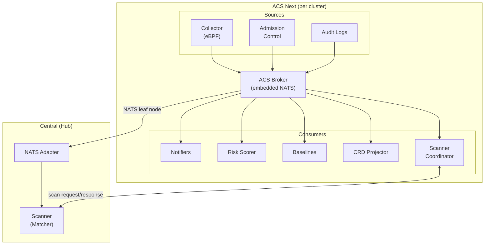
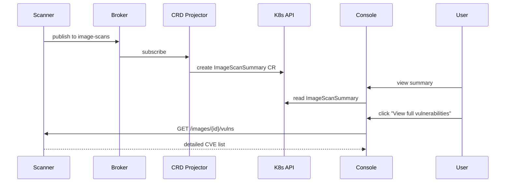
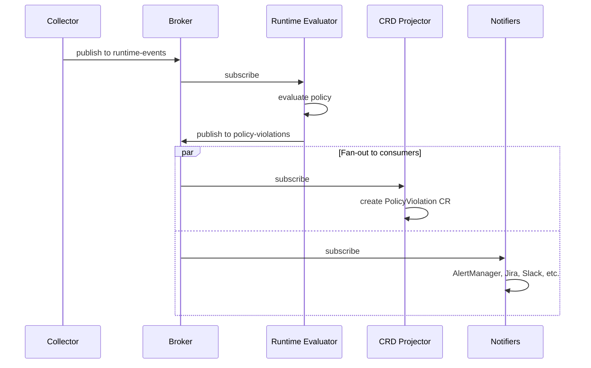
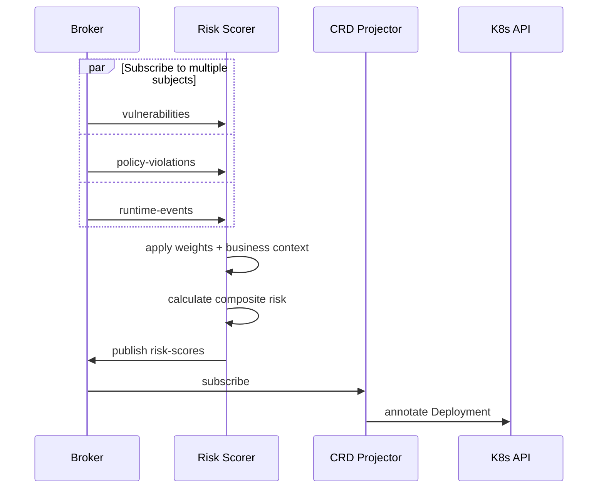
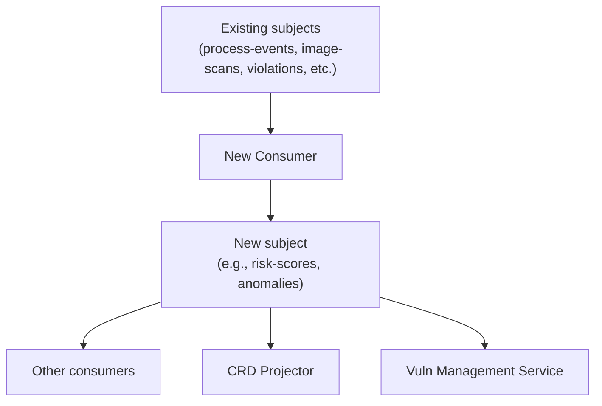

# ACS Next: Architecture Overview

*Status: Draft | Date: 2026-03-18*

---

## Overview

ACS Next is a single-cluster security platform built on an **event-driven architecture**. At its core is an **Event Hub** — an embedded pub/sub broker that aggregates all security data streams and allows consumers to subscribe to subjects of interest.

This design enables:
* **Decoupled components**: Producers and consumers evolve independently
* **Flexible deployment**: Users choose which consumers to run based on their needs
* **Minimal footprint option**: CRD-only deployment without any custom persistent API
* **Extensibility**: New consumers can be added without modifying core components

---

## Document Structure

This architecture is split across focused documents:

| Document | Content |
|----------|---------|
| **README.md** (this file) | Overview, core diagram, component summaries, data flows, design decisions |
| [central-integration.md](central-integration.md) | Central as hub, NATS adapter, hub scanner, evolution to VMS |
| [components/scanner.md](components/scanner.md) | Scanner indexer/matcher architecture, deployment topologies |
| [components/broker.md](components/broker.md) | Broker/NATS implementation, JetStream, subjects, recovery |
| [components/policy-engine.md](components/policy-engine.md) | Policy engine options, embedded vs separate, signature verification |
| [components/consumers.md](components/consumers.md) | CRD Projector, Alerting, Notifiers, Risk Scorer, Baselines |
| [components/vuln-management.md](components/vuln-management.md) | Vuln Management Service, database options, reporting, query API |
| [data-architecture.md](data-architecture.md) | Persistence strategy, CRD scaling, Prometheus metrics, exception workflow |
| [multi-cluster.md](multi-cluster.md) | Cross-cluster transport, fleet RBAC, ACM integration |
| [deployment.md](deployment.md) | Deployment profiles, topologies, installation/operator |
| [crds.md](crds.md) | Full CRD reference (schemas, examples, inventory) |

---

## Core Architecture

**Per-cluster subjects:** `acs.scan-requests`, `acs.scan-responses`, `acs.runtime-events`, `acs.process-events`, `acs.network-flows`, `acs.admission-events`, `acs.audit-events`, `acs.policy-violations`, `acs.risk-scores`, `acs.node-index`

**Hub-bound subjects:** `acs.hub.scan-requests`, `acs.hub.scan-responses.<cluster-id>`, `acs.<cluster-id>.*` (events for aggregation)

---

## Components

### Broker (Event Hub)

The central hub connecting all components. All raw data sources publish to the broker; all consumers subscribe from the broker. This avoids direct component-to-component connections.

See [Broker documentation](components/broker.md) for implementation details.

---

### Sources of Raw Data

These components generate security data and publish to the broker.

| Source | Purpose | Publishes to | Deployment |
|--------|---------|--------------|------------|
| **Collector** | eBPF runtime data + node indexing | `runtime-events`, `process-events`, `network-flows`, `node-index` | DaemonSet |
| **Admission Control** | Deploy-time validation webhook | `admission-events`, `policy-violations` | Deployment (HA) |
| **Audit Logs** | Control plane audit collection | `audit-events` | DaemonSet |

All sources except Audit Logs embed the policy engine for their respective lifecycle phase (runtime, deploy, build).

**Note:** Scanner runs on the hub (Central). See [Central Integration](central-integration.md) for the hub scanner architecture.

---

### Consumers

Consumers subscribe to broker subjects and perform actions. Users choose which consumers to deploy based on their needs.

| Consumer | Purpose | Consumes from | Deployment |
|----------|---------|---------------|------------|
| **Scanner Coordinator** | Routes scan requests to hub, caching, dedup | `scan-requests` | Deployment |
| **CRD Projector** | Projects summary CRs for OCP Console | `policy-violations`, `scan-responses` | Deployment |
| **Notifiers** | AlertManager, Jira, Splunk, Slack, SIEM | `policy-violations`, `scan-responses` | Deployment |
| **Risk Scorer** | Composite risk scores | `scan-responses`, `policy-violations`, `runtime-events` | Deployment |
| **Baselines** | Learns behavior, detects anomalies | `runtime-events`, `network-flows`, `process-events` | Deployment |

**Hub components** (in Central):

| Component | Purpose | Deployment |
|-----------|---------|------------|
| **NATS Adapter** | Receives events from all clusters | Central |
| **Scanner (Matcher)** | CVE matching, vuln DB | Central |

See [Central Integration](central-integration.md) for details on how Central evolves to become the Vuln Management Service.

See [Consumers documentation](components/consumers.md) for details.

---

## Data Flow Examples

### Example 1: Image Scan → Summary CR + Console Drill-Down

### Example 2: Runtime Event → Policy Violation → Alert

### Example 3: Risk Calculation

---

## Key Design Decisions

### Why Event Hub instead of direct storage?

With direct storage, producers are coupled to persistence — they write to a database, and that's the only consumer. Adding new consumers means modifying producers or building replication pipelines.

With an Event Hub, producers publish events without caring who consumes them. Multiple consumers can subscribe to the same subjects for different purposes: one creates CRs, another sends alerts, a third aggregates for fleet queries. New consumers subscribe to existing subjects without touching producers. Each consumer chooses its own persistence strategy — or none at all.

### Why embedded broker instead of external?

* **Footprint**: No additional infrastructure to deploy
* **Operational simplicity**: One less thing to manage
* **Latency**: In-process communication is faster
* **Trade-off**: Limited to single-cluster scale (which is the ACS Next model)

### Multiple ways to expose results

The broker is the source of truth, but there are multiple ways to expose security data to users and external systems:

* **CRs** — CRD Projector subscribes to broker subjects and creates summary CRs (PolicyViolation, ImageScanSummary). Good for OCP Console visibility and K8s RBAC.
* **Subjects** — External systems subscribe directly via NATS. Good for fleet aggregation (Vuln Management Service) or streaming to custom tooling.
* **REST API** — Vuln Management Service provides a query API backed by SQLite/PostgreSQL. Good for fleet-wide queries and reporting.
* **Annotations** — Components annotate existing resources (e.g., Deployments with risk scores). Good for surfacing data in existing workflows.
* **Prometheus metrics** — Components expose metrics for trends and alerting. Good for dashboards and threshold-based alerts.

Users choose which exposure mechanisms make sense for their deployment. A standalone cluster might use CRs + Prometheus. A fleet deployment might skip CRs entirely and use direct broker subscription + Vuln Management Service API.

### Per-cluster persistence is a choice, not a requirement

Different use cases can be served by different mechanisms — a dedicated per-cluster database is one option, not the only option:

| Use Case | Options |
|----------|---------|
| Vulnerability trends | Prometheus metrics + OCP dashboards, or Vuln Management Service |
| Event history | Notifiers to customer SIEM, or Vuln Management Service |
| CVE drill-down | Scanner per-image API (needs design), or Vuln Management Service |
| Cross-namespace queries | Prometheus metrics, PolicyViolation CRs, or Vuln Management Service |
| Fleet-level queries | Vuln Management Service |

A standalone cluster needing historical queries could deploy the Vuln Management Service locally. A fleet deployment centralizes this on the hub. A minimal deployment uses only Prometheus and CRDs. See [Data Architecture](data-architecture.md) for details.

### Feature Development Pattern

ACS Next establishes a repeatable pattern for adding new capabilities:
**subscribe to existing subjects, publish to new subjects.**

**Properties of this pattern:**

* **No modification to existing components** — new features don't touch Scanner, Collector, or the policy engine
* **Independent ownership** — a separate team can build, test, and release a new consumer
* **Composable** — new subjects become inputs for other consumers
* **Natural product tiering** — deploy the component for OPP customers, omit it for OCP-only

---

## Open Questions

1. **Scanner placement**: Hub scanner via NATS is the primary design (see [Central Integration](central-integration.md)). Open questions remain around cache TTL, scan result granularity, and fallback behavior.

2. **ACM RBAC validation**: Confirm ManagedClusterSet RBAC works for filtering Vuln Management Service data

3. **Scanner drill-down API**: Design Scanner API for per-image CVE queries (Console plugin drill-down)

4. **Footprint comparison**: How does ACS Next footprint compare to current Secured Cluster? Need real measurements.

5. **Installation UX**: Single operator with top-level CR? Profile-based installation? How do users configure component placement?

6. **OpenReports integration**: Should output CRDs use the [OpenReports.io](https://openreports.io/) standard instead of ACS-specific CRDs? Benefits: interoperability with other policy engines, existing tooling/dashboards, etcd offload via API aggregation. Backed by K8s Policy Working Group (Kyverno, Kubewarden, Fairwinds, SUSE).

## Next Steps

1. **Design NATS adapter for Central** — leaf node listener, translation layer, integration with existing pipeline
2. **Design Scanner Coordinator** — request dedup, caching, hub communication protocol
3. **Validate ACM RBAC model** — confirm ManagedClusterSet RBAC works for filtering addon data (ACM architect meeting)
4. **Define CRD schemas** — PolicyViolation, ImageScanSummary, VulnException, StackroxPolicy
5. **Define Prometheus metrics** — what each component exports
6. **Design Risk Scorer component** — per-cluster risk calculation, score aggregation
7. **Design Scanner drill-down API** — per-image CVE listing for Console plugin
8. **Prototype Console plugin** — single-cluster experience with CRDs + Scanner drill-down
9. **Notifier parity audit**: Which of the 14 current notifier types are P0 for ACS Next?

---

*This document describes the proposed architecture for ACS Next. It is a starting point for discussion, not a final design. See [Central Integration](central-integration.md) for the transitional architecture with Central as the multi-cluster hub.*
