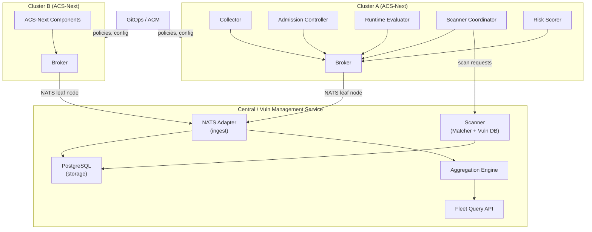
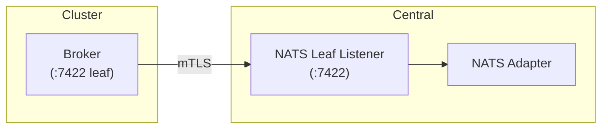
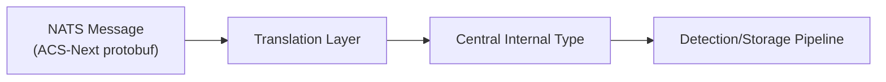
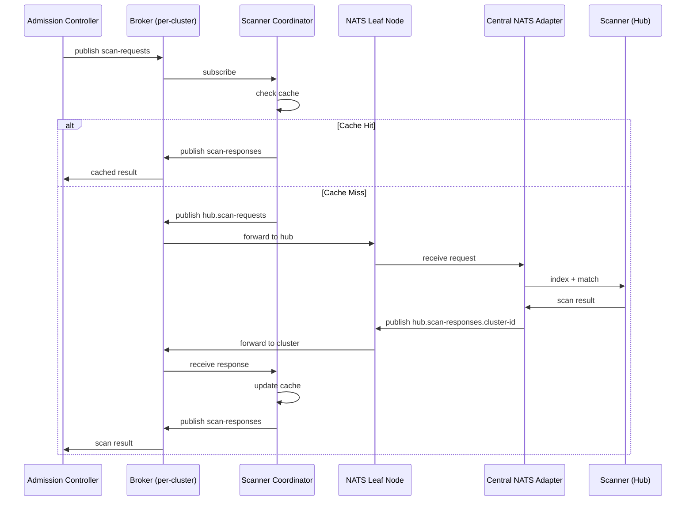
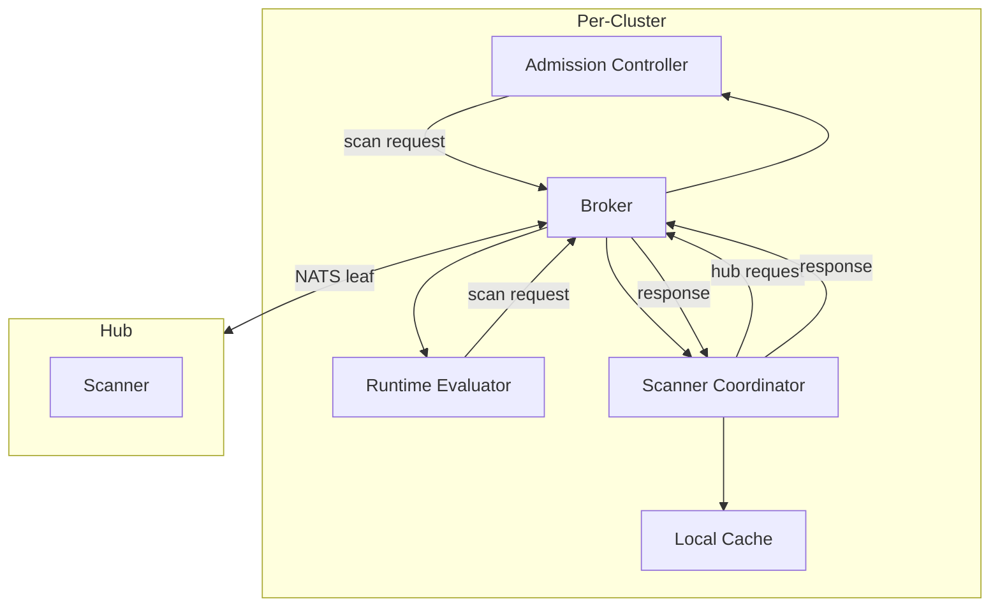
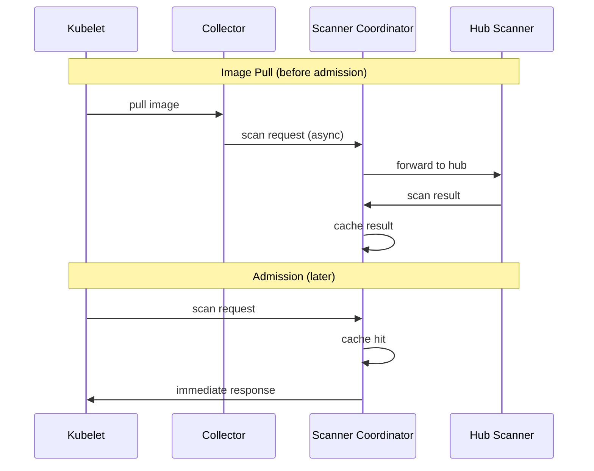
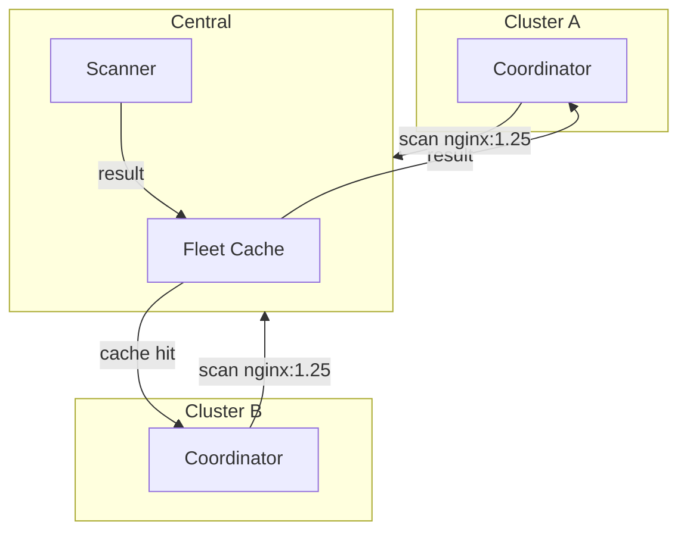
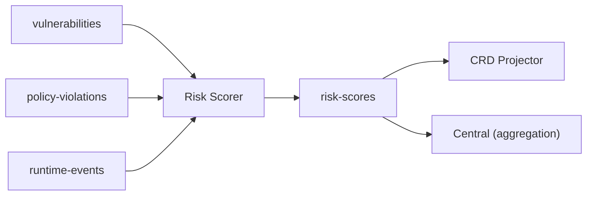
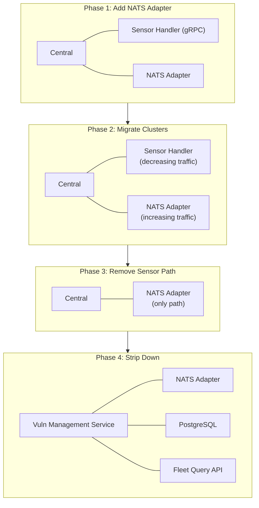
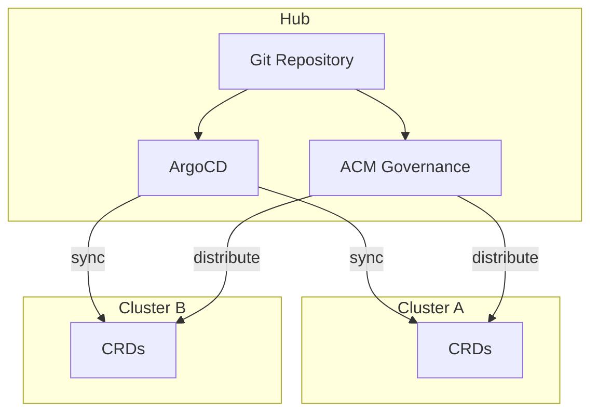

# Central Integration: Transitional Architecture

*Status: Draft | Date: 2026-03-18*

---

## Overview

This document describes how ACS-Next integrates with Central during the transition period. Rather than building a separate Vuln Management Service from scratch, Central gains a NATS adapter to consume events from ACS-Next clusters, positioning Central to eventually evolve into the Vuln Management Service.

**Key principles:**

* ACS-Next fully replaces secured cluster components (Sensor, Collector, legacy Scanner)
* Central remains the multi-cluster aggregation layer
* Data flows up via NATS (spoke to hub)
* Configuration flows down via GitOps/ACM (not via NATS)
* Central evolves toward Vuln Management Service by shedding unnecessary components

---

## Architecture



---

## Data Flow Principles

### Unidirectional NATS: Data Up Only

NATS connections are unidirectional for events and telemetry. Central receives data from clusters but does not push configuration via NATS.

| Direction | Transport | Content |
|-----------|-----------|---------|
| **Spoke to Hub** | NATS | Events, scan results, risk scores, violations |
| **Hub to Spoke** | GitOps/ACM | Policies, config, exceptions |

**Why unidirectional for config?**

* Encourages GitOps adoption (ArgoCD, Flux)
* Leverages ACM Governance for policy distribution
* No proprietary sync protocol to maintain
* Clear separation: real-time data vs declarative config

**Exception:** Scan request/response is bidirectional (see [Hub Scanner](#hub-scanner) below). This is data flow, not configuration.

### Subjects Flowing to Central

| Subject | Content | Retention |
|---------|---------|-----------|
| `acs.<cluster-id>.process-events` | Process start/stop, exec | Short (aggregation) |
| `acs.<cluster-id>.network-flows` | Connection events | Short (aggregation) |
| `acs.<cluster-id>.policy-violations` | Violations from all sources | Long (audit) |
| `acs.<cluster-id>.risk-scores` | Per-workload risk scores | Short (latest only) |
| `acs.<cluster-id>.node-index` | Host package inventory | Short (latest only) |
| `acs.hub.scan-requests` | Scan requests to hub | Until processed |
| `acs.hub.scan-responses.<cluster-id>` | Scan results from hub | Until consumed |

---

## NATS Adapter in Central

Central gains a new subsystem that accepts NATS leaf node connections from ACS-Next clusters.

### Connection Model

Clusters initiate connections to Central (matching existing Sensor model):



* Cluster init bundle includes Central's NATS endpoint and credentials
* mTLS authentication between cluster broker and Central
* Leaf node configuration controls which subjects cross the boundary

### Leaf Node Configuration

```yaml
# Cluster broker leafnode config
leafnodes:
  remotes:
    - url: "nats://central.example.com:7422"
      credentials: "/etc/nats/cluster-creds.creds"

      # Subjects sent to hub
      publish:
        - "acs.hub.>"              # Hub-bound requests
        - "acs.<cluster-id>.>"     # Cluster events

      # Subjects received from hub
      subscribe:
        - "acs.hub.scan-responses.<cluster-id>"
```

### Adapter Responsibilities

| Function | Description |
|----------|-------------|
| **Accept connections** | Leaf node listener for cluster brokers |
| **Subscribe to subjects** | `acs.*.process-events`, `acs.*.policy-violations`, etc. |
| **Translate events** | ACS-Next protobuf to Central internal model |
| **Route to handlers** | Feed existing detection/storage pipeline |
| **Cluster lifecycle** | Handle cluster add/remove, reconnects |
| **Metrics** | Connection status, message rates, lag |

### Translation Layer

The adapter translates ACS-Next event schemas to Central's internal types:



This is the only place where ACS-Next and Central schemas couple. Changes to either require updating the translation layer.

---

## Hub Scanner

Scanner runs on the hub (Central) to reduce per-cluster footprint and centralize vulnerability database management.

### Scan Request/Response Flow



### Subject Design

| Subject | Direction | Purpose |
|---------|-----------|---------|
| `acs.scan-requests` | Local | Components request scans |
| `acs.hub.scan-requests` | Spoke to Hub | Coordinator forwards to Central |
| `acs.hub.scan-responses.<cluster-id>` | Hub to Spoke | Central returns results |
| `acs.scan-responses` | Local | Coordinator forwards to requesters |

The `hub.` prefix distinguishes subjects that cross the leaf node boundary.

### Scanner Coordinator

The Scanner Coordinator is a per-cluster component that mediates between local components and the hub Scanner.



**Coordinator responsibilities:**

| Function | Benefit |
|----------|---------|
| **Deduplication** | Same image requested by multiple components becomes one hub request |
| **Caching** | Recently scanned images served locally |
| **Batching** | Aggregate requests before sending to hub |
| **Retry/circuit breaker** | Handle hub unavailability gracefully |
| **Request correlation** | Match responses to original requesters |
| **Metrics** | Scan latency, cache hit rate, hub availability |

### Latency Mitigation

Hub scanning adds network latency to admission decisions. Mitigation strategies:

| Strategy | Description |
|----------|-------------|
| **Aggressive caching** | Cache results for hours/days (vulns change slowly) |
| **Pre-scanning** | Scan on image pull, before admission |
| **Fleet-wide cache** | Central caches results; if Cluster A scanned image, Cluster B gets cached result |
| **Optimistic allow** | Allow admission, scan async, alert on violations |
| **Local fallback** | If hub unavailable, use stale cache or skip CVE check |

**Pre-scanning flow:**



### Fleet-Wide Caching

Central can cache scan results across all clusters:



Common base images (nginx, redis, postgres, ubi) get scanned once for the entire fleet.

---

## Per-Cluster Components

ACS-Next fully replaces the secured cluster stack:

| Component | Responsibility |
|-----------|----------------|
| **Broker** | Event hub, NATS leaf node to Central |
| **Collector** | eBPF runtime events, node indexing |
| **Admission Controller** | Deploy-time policy enforcement |
| **Runtime Evaluator** | Runtime policy evaluation |
| **Scanner Coordinator** | Scan request routing, caching |
| **Risk Scorer** | Composite risk calculation |
| **CRD Projector** | Summary CRs for Console visibility |
| **Notifiers** | Per-cluster alerting |

### Risk Scorer

Risk Scorer is a new per-cluster component that computes composite risk scores:



* Subscribes to relevant subjects
* Computes risk per workload using configurable weights
* Publishes to `acs.risk-scores`
* CRD Projector can annotate Deployments
* Central aggregates for fleet-level risk views

---

## Central Evolution Path

The NATS adapter enables Central to evolve toward Vuln Management Service:



### Components Removed During Evolution

| Component | Disposition | Rationale |
|-----------|-------------|-----------|
| Sensor gRPC handler | Remove | Replaced by NATS adapter |
| Policy engine | Remove | ACS-Next Runtime Evaluator handles per-cluster |
| Admission coordination | Remove | ACS-Next Admission Controller handles per-cluster |
| Compliance framework | Remove | compliance-operator handles this |
| Network graph builder | Remove | Per-cluster concern |
| Image scan coordination | Remove | ACS-Next Scanner Coordinator handles per-cluster |

### Components Retained (Become VMS)

| Component | Purpose in VMS |
|-----------|----------------|
| NATS Adapter | Ingest from all clusters |
| Scanner (Matcher) | CVE matching, vuln DB |
| PostgreSQL | Historical storage |
| Aggregation Engine | Fleet-wide rollups |
| Query API | Fleet CVE queries |
| Reporting | Scheduled reports, exports |

---

## Configuration Distribution

Configuration flows via GitOps and ACM, not NATS:



**Configuration CRDs:**

| CRD | Purpose |
|-----|---------|
| `StackroxPolicy` | Security policies |
| `VulnException` | Vulnerability exceptions |
| `Notifier` | Alerting integrations |
| `ImageRegistry` | Registry credentials |
| `SignatureVerifier` | Signature verification config |

This approach:

* Leverages existing GitOps tooling
* Uses ACM Governance for policy distribution
* Provides audit trail via git history
* Enables PR-based review for policy changes
* Requires no proprietary sync protocol

---

## Failure Modes

| Failure | Impact | Handling |
|---------|--------|----------|
| **Hub unreachable** | Scan requests queue locally | Circuit breaker, serve from cache |
| **Cluster broker crash** | Events buffered in JetStream | Replay on recovery |
| **NATS Adapter overloaded** | Backpressure to clusters | Horizontal scaling, rate limiting |
| **Scanner overloaded** | Scan latency increases | Queue depth monitoring, scaling |
| **Stale cache** | Old vuln data used | TTL on cache, background refresh |

---

## Open Questions

1. **Scan result granularity:** Full CVE list vs summary vs policy-relevant subset?

2. **Cache TTL:** How long are scan results valid? Hours? Days?

3. **Risk score aggregation:** Does Central compute fleet-level risk, or just store per-workload scores?

4. **Compliance rollup:** Who owns multi-cluster compliance UI? OCP Console? ACM?

5. **Legacy cluster support:** How long do we maintain the Sensor gRPC path alongside NATS?

---

## Related Documents

* [Architecture Overview](README.md)
* [Broker](components/broker.md)
* [Scanner](components/scanner.md)
* [Multi-Cluster](multi-cluster.md)
* [Migration Guide](../migration.md)

---

*This document describes the transitional architecture for Central integration. It will evolve as implementation progresses.*
