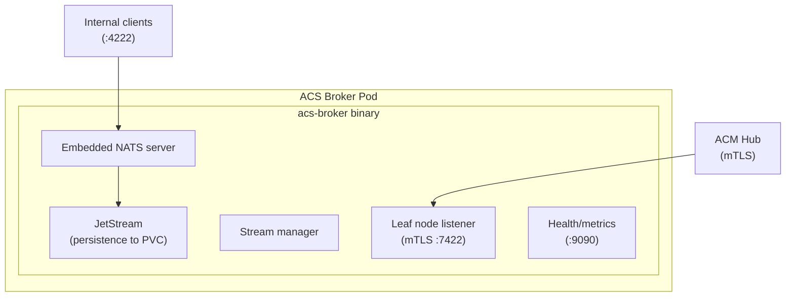
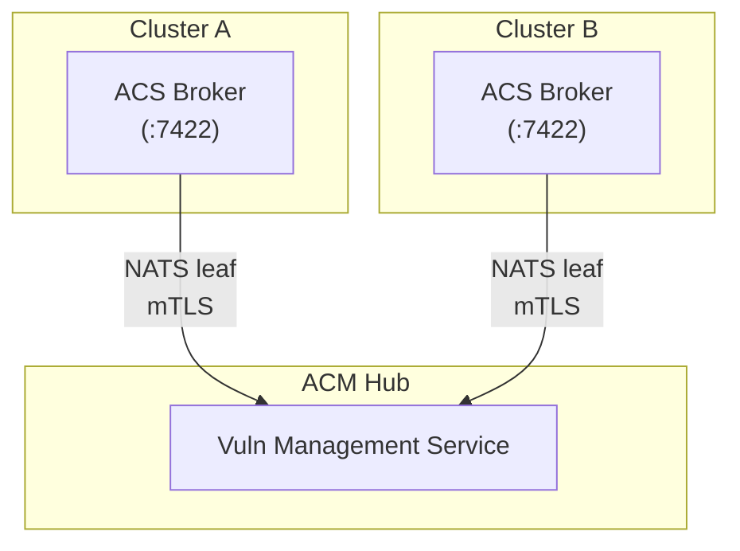

# Broker (ACS Broker with Embedded NATS)

*Part of [ACS Next Architecture](../)*

---

The Broker is the central nervous system — a pub/sub message broker that:

* Receives events from all producers (Collector, Scanner, Admission Control, etc.)
* Organizes events into typed feeds (NATS subjects)
* Allows consumers to subscribe to feeds with filtering (NATS wildcards)
* Provides delivery guarantees (at-least-once via JetStream)
* Handles backpressure
* Streams data across cluster boundaries via NATS leaf nodes (secured cluster → hub)

**Key design decision:** The Broker does **not** embed the policy engine. This enables:

* Cleaner separation of concerns
* Policy engine embedded in sources (Collector, Scanner, Admission Control) where evaluation happens
* Broker remains a thin messaging layer

## Implementation: Embedded NATS

**Decision:** The ACS Broker is a custom Go binary that embeds the NATS server as a library. NATS is not deployed as a separate operator — it's an implementation detail inside our broker process.

**Why NATS:**

| Requirement | NATS Fit |
|-------------|----------|
| Lightweight footprint | ~20-50MB embedded; no JVM, no external deps |
| K8s/cloud-native ecosystem | CNCF project; used in K8s ecosystem |
| Protobuf compatibility | Payload-agnostic; protobuf bytes work natively |
| Pub/sub with durability | JetStream provides at-least-once, replay, persistence |
| Cross-cluster streaming | Leaf nodes for ACM addon subscription |
| Go-native | Official client, embeddable server |

**Why embedded (not operator):**

* **Single deployment** — One pod, one binary, no operator dependency
* **NATS is invisible** — Customers see "ACS Broker", not "NATS"
* **Version control** — We control NATS version via go.mod
* **Simpler ops** — No CRDs for NATS, no operator reconciliation loops

## Architecture



**Resources:** ~50-100MB memory | Ports: 4222 (internal), 7422 (leaf/mTLS), 9090 (metrics)

## Example Implementation

```go
import (
    "github.com/nats-io/nats-server/v2/server"
    "github.com/nats-io/nats.go"
)

func main() {
    // Embedded NATS server
    opts := &server.Options{
        ServerName: "acs-broker",
        Host:       "0.0.0.0",
        Port:       4222,
        JetStream:  true,
        StoreDir:   "/data/jetstream",

        // Leaf node for external subscribers (ACM addon)
        LeafNode: server.LeafNodeOpts{
            Host:      "0.0.0.0",
            Port:      7422,
            TLSConfig: loadMTLSConfig(),
        },
    }

    ns, _ := server.NewServer(opts)
    go ns.Start()
    ns.ReadyForConnections(10 * time.Second)

    // In-process client (zero network hop)
    nc, _ := nats.Connect(ns.ClientURL())
    js, _ := nc.JetStream()

    // Create streams for ACS feeds
    js.AddStream(&nats.StreamConfig{
        Name:     "RUNTIME_EVENTS",
        Subjects: []string{"acs.*.runtime-events"},
    })
    js.AddStream(&nats.StreamConfig{
        Name:     "POLICY_VIOLATIONS",
        Subjects: []string{"acs.*.policy-violations"},
    })

    select {}  // Block forever
}
```

## Subject Hierarchy

NATS uses dot-separated subjects with wildcard support:

| Feed | Subject Pattern | Example |
|------|-----------------|---------|
| Runtime events | `acs.<cluster>.runtime-events` | `acs.cluster-a.runtime-events` |
| Process events | `acs.<cluster>.process-events` | `acs.cluster-a.process-events` |
| Network flows | `acs.<cluster>.network-flows` | `acs.cluster-a.network-flows` |
| Policy violations | `acs.<cluster>.policy-violations` | `acs.cluster-a.policy-violations` |
| Vulnerabilities | `acs.<cluster>.vulnerabilities` | `acs.cluster-a.vulnerabilities` |
| Image scans | `acs.<cluster>.image-scans` | `acs.cluster-a.image-scans` |
| Node index | `acs.<cluster>.node-index` | `acs.cluster-a.node-index` |

**Wildcards:**

* `acs.*.policy-violations` — All clusters' violations (single-level wildcard)
* `acs.cluster-a.>` — All feeds from cluster-a (multi-level wildcard)

## JetStream Streams

JetStream provides durability and replay:

| Stream | Subjects | Retention | Notes |
|--------|----------|-----------|-------|
| `RUNTIME_EVENTS` | `acs.*.runtime-events` | Limits (size/age) | High-volume, recent events |
| `POLICY_VIOLATIONS` | `acs.*.policy-violations` | Interest-based | Must not lose violations |
| `VULNERABILITIES` | `acs.*.vulnerabilities` | Limits | Scan results |
| `IMAGE_SCANS` | `acs.*.image-scans` | Limits | Full scan data |
| `NODE_INDEX` | `acs.*.node-index` | Limits | Host package inventory |

## Consumer Recovery and Failure Modes

**The problem ACS Next solves differently:** Current ACS handles Central-Sensor disconnects with elaborate sync machinery (90+ files). ACS Next eliminates cross-cluster sync but must still handle local component failures. JetStream provides the recovery mechanism, but this has resource implications.

**Failure scenarios and recovery:**

| Component | On Crash | Recovery Mechanism | Retention Needed |
|-----------|----------|-------------------|------------------|
| Policy Engine (in Collector) | Misses runtime events | Durable consumer replays from last ack | Minutes (catch-up window) |
| Notifiers | Violations queue in broker | Durable consumer replays missed violations | Hours (must not lose) |
| CRD Projector | Events queue, CRs stale | Durable consumer replays; may need catch-up mode | Minutes |
| Baselines | Misses learning data | Acceptable loss; baselines are statistical | None (ephemeral OK) |
| Risk Scorer | Misses inputs | Acceptable; risk recalculates periodically | None (ephemeral OK) |
| Broker (acs-broker) | All consumers stall | JetStream replays from PVC on restart | Full retention window |

**Durable vs. ephemeral consumers:**

* **Durable consumers** (track position, survive restarts): Notifiers, CRD Projector, ACM addon
* **Ephemeral consumers** (start from "now"): Baselines, Risk Scorer, optional analytics

**Storage implications:**

Durable consumers with replay require JetStream to retain messages. Rough sizing:

| Stream | Event Rate | Retention | Storage (estimate) |
|--------|------------|-----------|-------------------|
| `RUNTIME_EVENTS` | ~1000/min (busy cluster) | 15 min | ~50-100 MB |
| `POLICY_VIOLATIONS` | ~10/min (typical) | 24 hours | ~5-10 MB |
| `VULNERABILITIES` | ~100/scan | Until consumed | ~10-20 MB |
| `IMAGE_SCANS` | Variable | 1 hour | ~50-100 MB |
| **Total per cluster** | | | **~150-300 MB** |

*These are rough estimates. Actual sizing depends on cluster activity, event payload sizes, and retention policy decisions.*

**What's acceptable to lose:**

| Data Type | Acceptable to Lose? | Rationale |
|-----------|---------------------|-----------|
| Policy violations | **No** | Security-critical; must reach alerting |
| Runtime events (for policy) | **Yes** (bounded) | If 15 min of events lost, re-evaluation on next event catches up |
| Baseline learning events | **Yes** | Statistical; gaps smooth out over time |
| Scan results | **No** | Would require re-scan; expensive |
| Risk score inputs | **Yes** | Risk recalculates; eventual consistency OK |

**Open decisions:**

1. **Retention window sizes** — Affects PVC sizing; 15 min vs 1 hour vs 24 hours
2. **Catch-up performance** — If consumer falls behind, how fast must it catch up?
3. **Backpressure handling** — If broker fills, drop oldest events or block publishers?

## Feed Schema

Events are typed with protobuf schemas. Each feed has a well-defined event type:

```protobuf
message RuntimeEvent {
  string cluster_id = 1;
  string namespace = 2;
  string pod = 3;
  google.protobuf.Timestamp timestamp = 4;
  oneof event {
    ProcessEvent process = 5;
    NetworkEvent network = 6;
    FileEvent file = 7;
  }
}
```

---

## External Subscribers (ACM Addon)

The ACS Broker exposes a NATS leaf node listener (mTLS) for external subscribers. This enables **ACM addon to subscribe directly to broker feeds**, bypassing the K8s API entirely.

### What is a NATS Leaf Node?

A [NATS leaf node](https://docs.nats.io/running-a-nats-service/configuration/leafnodes)
is a connection mode that bridges NATS servers across network boundaries. The managed cluster's broker exposes a leaf node listener, and the
hub connects as a leaf. Messages published to topics on the managed cluster
automatically flow to subscribers on the hub — no polling, no intermediate
storage.

**Key properties:**

* **Secure by default** — mTLS authentication between clusters
* **Selective routing** — only subscribed topics flow across the connection
* **Automatic reconnection** — handles network interruptions gracefully
* **Push-based** — real-time message delivery, not request/response
* **Independent state** — each side maintains its own JetStream state; the hub
  doesn't become part of the managed cluster's NATS cluster

**Why this matters:**

| Approach | Scalability | Security |
|----------|-------------|----------|
| **CRD-based** (write CRs, ACM Search indexes) | Limited by CR count; 1000 images × 50 CVEs = 50k CRs | Security data traverses K8s API |
| **Direct subscription** (ACM addon subscribes to feeds) | No CR limit; addon aggregates in-memory | mTLS between Event Hub and addon; bypasses K8s API |

**Architecture with NATS leaf nodes:**



**Benefits:**
* **No CR cardinality problem**: Vulnerability data streams directly to addon, no 50k CRs per cluster
* **Better security posture**: Security data never touches K8s API; attackers with K8s API access don't see vulnerability feeds
* **Lower latency**: Direct streaming vs CR write → index → query
* **Simpler managed cluster**: No CRD Projector needed if using direct subscription

**Trade-off:** Requires ACM addon to be running. Standalone clusters (no ACM) would still use CRD Projector for local visibility.
