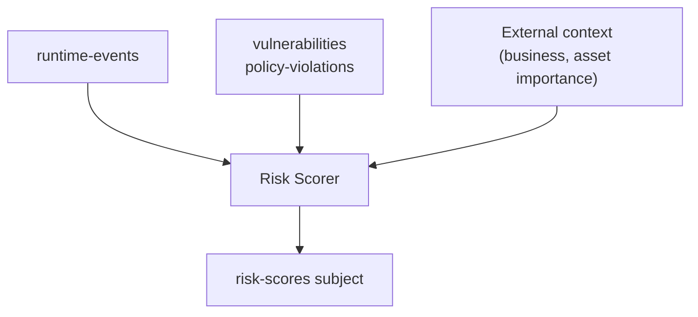

# Consumers

*Part of [ACS Next Architecture](../)*

---

Consumers are downstream components that require data from upstream sources
(Collector, Scanner, Admission Control). Data flows to consumers via the broker.

Deploy the consumers that fit your needs — a minimal deployment might use only
Notifiers, while a full deployment runs all of them.

---

## CRD Projector

* **What it does**: Projects **summary-level** security data into Kubernetes CRs
* **Consumes**: `policy-violations`, `image-scans`
* **Outputs**: `PolicyViolation`, `ImageScanSummary` CRs (summary-level only)
* **Use case**: Local OCP Console visibility, K8s RBAC for security data
* **Key design**: OCP Console is powered by these CRs — no DB required for basic visibility

**Important:** The CRD Projector writes summary CRs only — not raw vulnerability
data. Full CVE-level data does **not** become CRs. When a user drills into a
specific image's vulnerabilities in the Console, the Console plugin calls the
Scanner directly for the full vulnerability report. This keeps CR counts
manageable (hundreds to low thousands) while still providing drill-down
capability.

**Example CR:**

```yaml
apiVersion: security.openshift.io/v1
kind: PolicyViolation
metadata:
  name: deployment-nginx-privileged
  namespace: production
  labels:
    policy: no-privileged-containers
    severity: high
spec:
  policy: no-privileged-containers
  resource:
    kind: Deployment
    name: nginx
    namespace: production
  violation:
    message: "Container 'nginx' is running as privileged"
    timestamp: "2026-02-27T10:30:00Z"
status:
  state: Active
```

## Notifiers

* **What it does**: Sends notifications to external systems
* **Consumes**: `policy-violations`, `vulnerabilities` (configurable)
* **Outputs**: AlertManager, Jira tickets, Splunk events, Slack messages, AWS Security Hub, etc.
* **Notes**: AlertManager is one notifier type among many. Also serves as the event
  history mechanism — pushes security events to customer SIEM for incident response
  queries (see [Data Architecture](../data-architecture.md))

## Risk Scorer

* **What it does**: Calculates composite risk scores for workloads
* **Consumes**: `vulnerabilities`, `policy-violations`, `runtime-events`
* **Outputs**: Risk scores (publishes back to broker for other consumers)
* **Use case**: Prioritization dashboards, configurable risk weighting based on business context
* **Notes**: Designed for configurability — users adjust weights, factor in business context

**Data sources:**



## Baselines

* **What it does**: Learns normal behavior patterns, detects anomalies
* **Consumes**: `runtime-events`, `network-flows`, `process-events`
* **Outputs**: Baseline CRs, anomaly alerts (to broker)
* **Use case**: Process baseline violations, network anomaly detection, policy refinement

---

## Vuln Management Service

Fleet-wide vulnerability aggregator with query API. See [Vuln Management Service](vuln-management.md) for full design.

* **Consumes**: `image-scans`, `vulnerabilities` via NATS leaf nodes
* **Outputs**: Fleet-wide query API, scheduled reports
