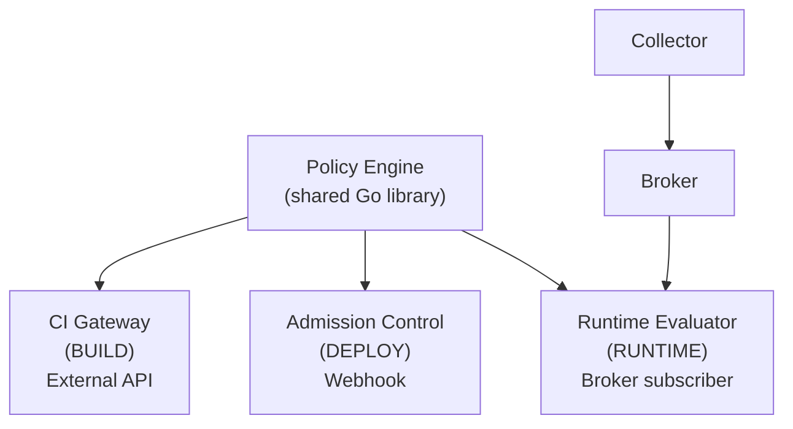
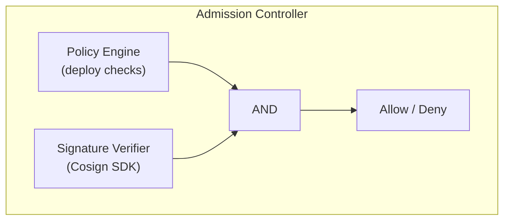

# Policy Engine

*Part of [ACS Next Architecture](../)*

---

The policy engine is a **shared Go library**, not a standalone service. Components
that need to evaluate policies embed this library directly. This eliminates network
dependencies in latency-sensitive paths (admission webhooks) and allows each
component to scale independently.

All components read from the same `StackroxPolicy` CRDs. Each filters policies by
lifecycle phase and evaluates only those relevant to its phase. Violations are
published to the broker's `policy-violations` subject.

---

## Components with Embedded Policy Engine

Multiple components embed the policy engine library. Each reads the same set of
policy CRDs and filters based on lifecycle phase:

| Component | Phase | Example Policies |
|-----------|-------|------------------|
| CI Gateway | Build | Image CVE thresholds, required labels, base image restrictions |
| Admission Control | Deploy | Privileged containers, resource limits, namespace restrictions |
| Runtime Evaluator | Runtime | Process execution, network connections, file access |

**How it works:**
* Policy CRDs are the source of truth (distributed via ACM Governance)
* Each component watches policy CRDs and loads relevant policies
* Policy engine is a Go library compiled into each component
* Violations published to `policy-violations` subject

**Multi-phase policies:**

A single policy can span multiple phases:

```yaml
apiVersion: acs.openshift.io/v1
kind: StackroxPolicy
spec:
  name: no-privileged-containers
  lifecycleStages:
    - DEPLOY
    - RUNTIME
```

Each component filters policies by phase and evaluates those containing its phase.

**Cross-phase criteria:**

Policies can combine deploy-time and runtime criteria:

```
"Alert if image from untrusted registry AND container executes shell"
```

This works because:
* Runtime evaluation has full deployment context (image, registry, labels)
* Collector has local access to K8s API for pod/deployment specs
* Policy engine evaluates against all available context at evaluation time

This mirrors current ACS where Sensor evaluates policies locally with deployment context + runtime events. ACS Next is the same pattern — policies from CRDs instead of Central gRPC, but same local evaluation model.

---

## Policy Engine Architecture Options

The policy engine can be deployed in different ways depending on organizational and operational goals. This section lays out the options.

### Constraints by Phase

| Phase | Sync Required? | Can Decouple from Source? | Notes |
|-------|----------------|---------------------------|-------|
| Build | Yes (CI waits) | Yes, with latency cost | Scanner has image context |
| Deploy | Yes (webhook) | **No** — must be in webhook path | Admission latency critical |
| Runtime (alert) | No | Yes | Async evaluation acceptable |
| Runtime (enforce) | Fast preferred | Yes, with latency cost | Kill pod, scale to zero |

**Key constraint:** Admission webhooks are synchronous. The policy engine for deploy-time MUST be in the admission path. A separate Policy Evaluator service would add latency and a hard dependency — if it's down, nothing deploys.

### Option A: Embedded in Each Source (Current Proposal)

```
Scanner (embeds policy engine) ─────────────────► violations
Admission Control (embeds policy engine) ────────► violations
Collector (embeds policy engine) ────────────────► violations
```

* **Pros:** Simple deployment, no network dependencies, low latency
* **Cons:** Collector becomes more complex (needs K8s API access for deployment context)

### Option B: Separate Runtime Evaluator (Collector Independent)

```
Scanner (embeds policy engine) ─────────────────────────► violations
Admission Control (embeds policy engine) ───────────────► violations
Collector (raw events only) ──► Broker ──► Runtime Evaluator ──► violations
```

* **Pros:**
  * Collector stays simple (just eBPF collection)
  * Conway's Law: Collector can be independent operator consumed by ACS
  * Runtime processing isolated from admission failure domain
* **Cons:**
  * Additional component (Runtime Evaluator)
  * Latency for runtime enforcement actions

**Why isolate runtime from admission?**

| Scenario | Separate Evaluator | Combined with Admission |
|----------|-------------------|------------------------|
| Runtime bug crashes evaluator | Deploys still work | **Deploys blocked** |
| Runtime event flood | Evaluator falls behind | **Admission slows** |
| Runtime memory leak | Evaluator OOMs | **Admission OOMs** |

Admission Controller is critical path — keeping it lean and isolated from unpredictable runtime workloads is safer.

### Option C: Unified Policy Evaluator Service

```
Scanner ──────────► Policy Evaluator ◄──────── Admission Control
                         ▲                    (gRPC call)
                         │
Collector ──► Broker ────┘ (subscribes)
```

* **Pros:** Single policy logic location
* **Cons:**
  * Admission Controller has network dependency in critical path
  * If Policy Evaluator down → cluster can't deploy
  * Combines failure domains

**Not recommended** due to admission reliability concerns.

### Recommendation

**Option B (Separate Runtime Evaluator)** with shared policy engine library:



**Benefits:**
* Collector is independent (can be separate operator/team)
* Admission isolated from runtime workloads
* Same policy engine code, different binaries
* Each component scales independently

---

## Signature Verification

Image signature verification (Cosign, Sigstore) is primarily a **deploy-time** concern — blocking unsigned images before they run.

### Where Signature Verification Belongs

| Phase | Use Case | Priority |
|-------|----------|----------|
| Build | "Fail CI if image isn't signed" | Optional |
| **Deploy** | "Block unsigned images from cluster" | **Primary** |
| Runtime | Image already running | N/A |

**Primary enforcement: Admission Controller**

Admission Controller should verify signatures during admission. This matches how other tools work (Connaisseur, Kyverno, Gatekeeper).



**Configuration:**

```yaml
apiVersion: acs.openshift.io/v1
kind: SignatureVerifier
metadata:
  name: prod-signing-keys
spec:
  type: cosign
  keys:
    - secretRef:
        name: cosign-public-key
        key: cosign.pub
  # OR keyless (Fulcio/Rekor)
  keyless:
    issuer: https://accounts.google.com
    subject: builder@example.com
```

**Scanner's role (build-time):**

Scanner can also verify signatures for build-time CI checks ("fail CI if unsigned"). This complements admission enforcement — both use the same signature verification library.
