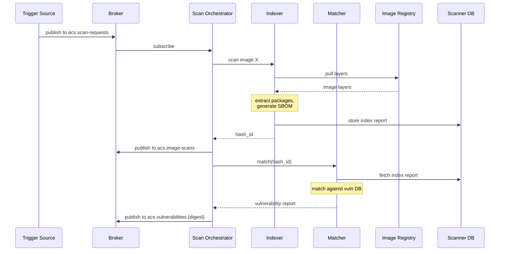
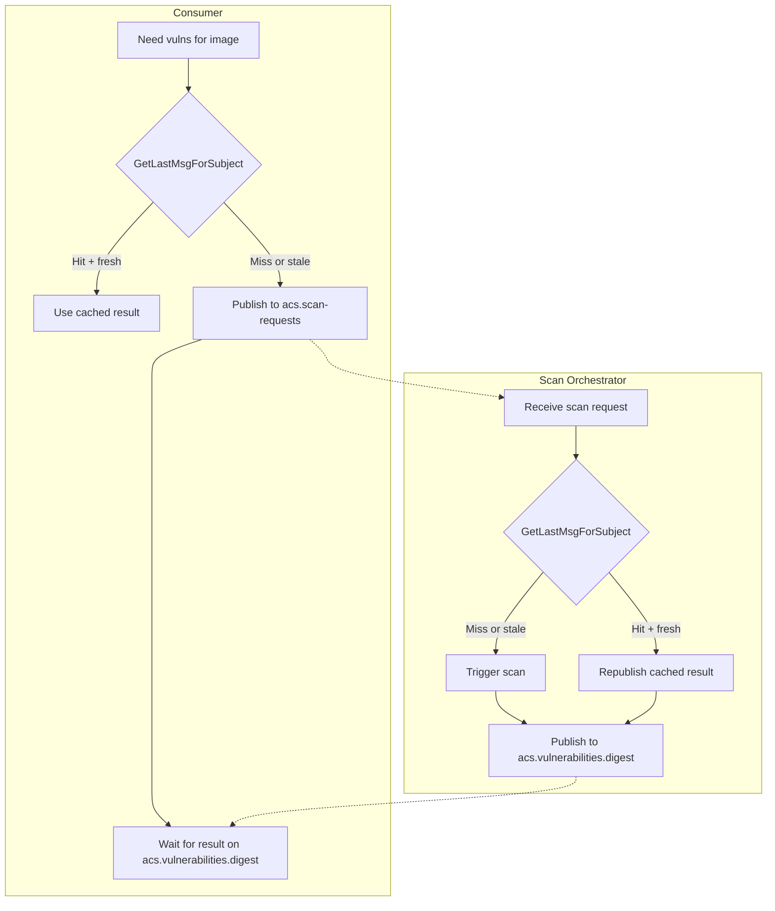

# Scanner Architecture

*Part of [ACS Next Architecture](../)*

---

## Why Scanner is Standalone

Scanner provides value beyond ACS — any Red Hat product that needs image
vulnerability scanning can use it:

* **Quay** — registry-integrated scanning
* **OpenShift Pipelines** — CI/CD gate for vulnerable images
* **RHEL Image Builder** — build-time vulnerability checks
* **OpenShift Console** — image security insights without full ACS
* **roxctl / CI tasks** — `roxctl image scan` for pipeline integration

The `StackroxScanner` CRD allows independent deployment and configuration
without requiring the full ACS stack. This makes Scanner a shared asset
across the Red Hat portfolio.

### CI/CD API (CI Gateway)

The **CI Gateway** is a separate component that exposes a public REST API for
CI/CD integration:

```
POST /v1/scan
{
  "image": "registry.example.com/app:v1.2.3"
}
```

This enables:
* `roxctl image scan` without requiring full ACS deployment
* Tekton tasks that gate on vulnerability thresholds
* GitHub Actions / GitLab CI integration

The CI Gateway:
* Embeds the policy engine for build-time policy evaluation
* Calls Scan Orchestrator to get vulnerability results
* Returns combined response (scan results + policy violations)

**Deployment flexibility:** CI Gateway can be deployed on any cluster reachable
by CI pipelines, regardless of where Scanner components run. This enables
topologies where Scanner is centralized but CI Gateway is distributed.

**Failure domain isolation:** Today, CI pipelines depend on Central — when
Central goes down, pipelines are blocked. With CI Gateway + Scanner standalone,
CI/CD scanning has its own failure domain, decoupled from the rest of ACS.

---

## Components

The Scanner subsystem consists of four components:

**CI Gateway**
* Exposes external REST API (`POST /v1/scan`) for CI/CD integration
* Embeds policy engine for build-time policy evaluation
* Calls Scan Orchestrator, returns combined scan + violation results
* **Requires**: Connectivity to Scan Orchestrator; network visibility from CI pipelines

**Scan Orchestrator**
* Subscribes to `acs.scan-requests` for scan triggers
* Requests Indexer to scan specific images
* Sends hash_id to Matcher for vulnerability matching
* Publishes results to `acs.image-scans` and `acs.vulnerabilities`
* **Requires**: Connectivity to Broker, Indexer, and Matcher

**Indexer**
* Pulls container images from registries on request from Scan Orchestrator
* Extracts installed packages (RPM, APK, DEB, language packages)
* Generates SBOM (Software Bill of Materials)
* Returns image index (package inventory) to Scan Orchestrator
* **Requires**: Network access to image registries

**Matcher**
* Receives scan requests (hash_id) from Scan Orchestrator
* Fetches image index from Indexer (or accepts inline for local scanning)
* Matches packages against the vulnerability database
* Returns vulnerability reports (CVEs, severity, fixability) to Scan Orchestrator
* **Requires**: Access to vulnerability database (bundled or fetched)



## Result Caching

Scan results are cached using JetStream's built-in persistence. This avoids
redundant scans — critical for the admission control path where the same
image may be referenced by multiple pods.

**Subject hierarchy as cache:**

Results are published to digest-specific subjects:

```
acs.vulnerabilities.sha256:abc123
acs.vulnerabilities.sha256:def456
```

JetStream stream configuration:
* **MaxMsgsPerSubject**: 1 (keep only latest result per image)
* **MaxAge**: 1 hour (ensures fresh vuln data as database updates)
* **Storage**: File (persists across restarts)

**Cache lookup:**

Any consumer can check for cached results via `GetLastMsgForSubject`:

```go
msg, err := js.GetLastMsg("VULNERABILITIES", "acs.vulnerabilities.sha256:abc123")
if err == nil && time.Since(msg.Time) < maxAge {
    // Cache hit — use msg.Data
}
```

**Flow:**



**Why this approach?**

| Concern | How it's addressed |
|---------|-------------------|
| Durability | JetStream persists to disk — survives restarts |
| No duplication | Single stream serves both pub/sub and cache lookups |
| Shared cache | All consumers read from same stream |
| No new components | Uses existing broker infrastructure |
| Capacity | Scales with disk, not memory |

**Why full results?**

Consumers like the Admission Controller need full CVE details to evaluate
policies (e.g., "block images with CVSS > 9.0"). Summary-only caching would
require a round-trip to fetch details.

## Deployment Topologies

Each component can be deployed on the spoke cluster, the hub, or a combination — depending on customer constraints.

| Topology | Orchestrator | Indexer | Matcher | Use Case |
|----------|--------------|---------|---------|----------|
| **Local (full)** | Spoke | Spoke | Spoke | Air-gapped clusters, low latency requirements |
| **Split** | Spoke | Spoke | Hub | Resource-constrained spokes, centralized vuln DB management |
| **Delegated** | Hub | Hub | Hub | Minimal spoke footprint, hub has registry access |

### Topology 1: Local (Full Scanner on Spoke)

* **When to use**:
  * Air-gapped or disconnected clusters
  * Strict data locality requirements
  * Low-latency scanning needed
* **Trade-offs**:
  * Higher resource consumption on spoke (~2-4 GB RAM for matcher + vuln DB)
  * Vuln DB updates must reach each cluster

### Topology 2: Split (Indexer on Spoke, Matcher on Hub)

In split topology, the index is sent inline because the hub Matcher cannot reach the spoke Indexer.

* **When to use**:
  * Spoke clusters have registry access but limited resources
  * Centralized vulnerability database management preferred
  * Hub has good connectivity to spokes
* **Trade-offs**:
  * Lower spoke footprint (~200-500 MB for indexer + orchestrator)
  * Single vuln DB to update (on hub)
  * Requires spoke-to-hub connectivity for matching
  * Image layers stay on spoke (only index sent to hub)

### Topology 3: Delegated (Full Scanner on Hub)

* **When to use**:
  * Spoke clusters cannot reach image registries (hub has access)
  * Minimal spoke footprint required
  * Centralized scanning infrastructure preferred
* **Trade-offs**:
  * Lowest spoke resource usage (no scanner components)
  * Hub must have network access to all image registries
  * Higher hub resource requirements (scales with fleet size)
  * Scan latency depends on hub connectivity

## Deployment Decision Matrix

| Constraint | Recommended Topology |
|------------|---------------------|
| Air-gapped spoke clusters | Local |
| Spoke cannot reach registries, hub can | Delegated |
| Spoke has <4GB RAM available for security | Split or Delegated |
| Strict data locality (images can't leave cluster) | Local |
| Want single vuln DB to manage | Split or Delegated |
| Hub has limited connectivity to spokes | Local |
| Mixed constraints across fleet | Mix topologies per cluster |

## Configuration

Scanner topology is configured per-cluster via the `StackroxScanner` CRD:

```yaml
apiVersion: acs.openshift.io/v1
kind: StackroxScanner
metadata:
  name: scanner-config
  namespace: acs-next
spec:
  # Topology: "local", "split", or "delegated"
  topology: split

  indexer:
    # Only applies to "local" and "split" topologies
    resources:
      requests:
        memory: "500Mi"
        cpu: "200m"
      limits:
        memory: "2Gi"
        cpu: "2"
    registryAccess:
      # Pull secrets for image registries
      imagePullSecrets:
        - name: registry-credentials

  matcher:
    # Only applies to "local" topology
    # For "split"/"delegated", matcher runs on hub
    resources:
      requests:
        memory: "2Gi"
        cpu: "500m"
      limits:
        memory: "4Gi"
        cpu: "4"
    vulnDatabase:
      # "bundled" (offline) or "online" (fetch updates)
      mode: online
      updateInterval: 4h

  hub:
    # For "split" and "delegated" topologies
    # How to reach the hub's matcher service
    endpoint: "https://scanner.acm-hub.svc:8443"
    # mTLS client cert for hub communication
    tlsSecretRef:
      name: hub-scanner-client-tls
```

## Fleet-Level Scanner Management

For multi-cluster deployments, ACM Governance distributes `StackroxScanner` CRDs:

```yaml
apiVersion: policy.open-cluster-management.io/v1
kind: Policy
metadata:
  name: scanner-topology-policy
spec:
  remediationAction: enforce
  policy-templates:
    - objectDefinition:
        apiVersion: acs.openshift.io/v1
        kind: StackroxScanner
        metadata:
          name: scanner-config
        spec:
          topology: split  # Default for most clusters
          # ...
```

Clusters can be grouped by topology requirements using placement rules — e.g., air-gapped clusters get `topology: local`, resource-constrained edge clusters get `topology: delegated`.
