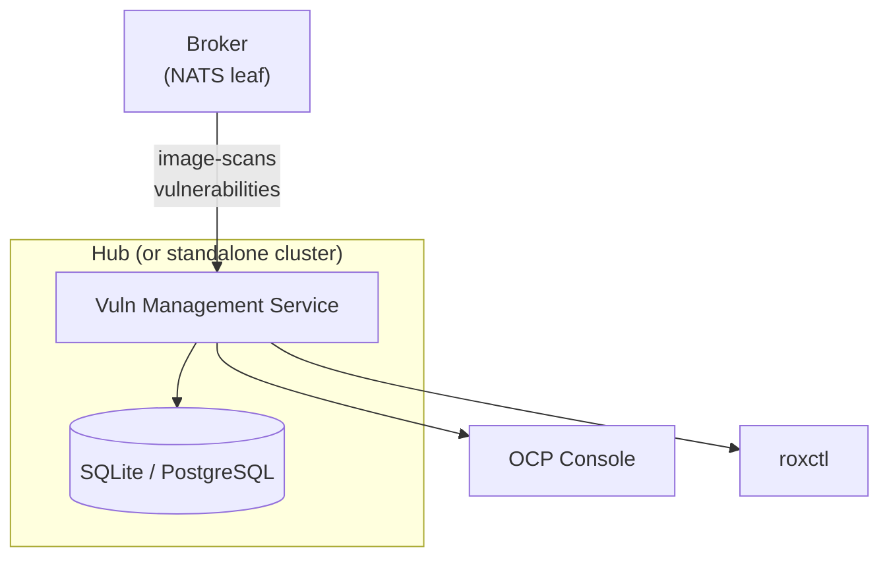

# Vuln Management Service

*Part of [ACS Next Architecture](../)*

---

The Vuln Management Service aggregates vulnerability data across clusters and
provides fleet-wide query and reporting capabilities. It typically runs on the
ACM hub for fleet-wide queries, but can also run per-cluster for single-cluster
deployments.

## Why It Exists

At the fleet level, a security admin needs queries that span clusters:

* "Which images across my fleet are affected by CVE-2024-1234?"
* "What's the fleet-wide vulnerability posture by severity?"
* "Show me all clusters running images with critical unfixed CVEs."

These are relational queries. CRDs can't answer them — no relational joins
(e.g., "which images have this CVE") and scaling limits. Prometheus can
answer aggregate counts but not "which specific images." ACM Search can
answer some of these if CRs are indexed, but struggles with CVE-level
granularity.

The Vuln Management Service is purpose-built for this.

## Architecture



**Subscribes to:** `image-scans`, `vulnerabilities` (via NATS leaf nodes in
multi-cluster, or direct broker connection in single-cluster)

**Query API:** `GET /images?cve=X`, `GET /images/{id}/vulns`, `GET /summary`,
`GET /export`

## Data Model

Every record includes a `cluster_id` dimension:

* Image scan results: image manifest, component inventory, matched CVEs,
  cluster where the image is running
* Aggregates: CVE impact across clusters, images affected per CVE

## Database Options

| Fleet Size | Default DB | Rationale |
|------------|------------|-----------|
| Small (< 20 clusters) | SQLite on PVC | No operational overhead, single file |
| Large (20+ clusters) | PostgreSQL (BYODB) | Customer provides their own DB for scale |

SQLite handles reads well and write volume is modest — scan results arrive
in batches, not streaming. For larger fleets, customers can point the
service at their own PostgreSQL instance.

**Potential alternative: per-cluster SQLite sharding.** Instead of one
SQLite file for all clusters, use one SQLite file per managed cluster.
This has several appealing properties:

* **Single-cluster mode becomes trivial** — same binary, same code, one
  shard. The Vuln Management Service can run per-cluster with zero
  changes, making it available outside the multi-cluster addon.
* **Cluster isolation is physical, not logical** — no `WHERE cluster_id = ?`
  on every query, no risk of cross-cluster data leaks from query bugs.
* **Adding/removing a cluster** is creating/deleting a file.
* **Fleet-wide queries** open all relevant shards, query each, merge
  results. SQLite handles concurrent readers well.
* **BYODB migration** — when a customer outgrows sharded SQLite, switch
  to PostgreSQL with `cluster_id` as a column. The abstraction layer
  changes from "query N files, merge" to "query one DB with filter."

The trade-off is fleet-wide queries at large scale — querying 200 SQLite
files and merging is more work than a single indexed PostgreSQL query.
But at that fleet size, the customer should be on BYODB anyway.

## Scheduled Reporting

Current ACS has a full report lifecycle management feature — configure,
schedule, generate, deliver, track history. ACS Next preserves this
capability as an internal component of the Vuln Management Service rather
than a separate microservice.

### Current ACS Reporting (for reference)

* **Report types**: Vulnerability reports (CVE data across deployments/images)
* **Scheduling**: Cron-based — daily, weekly, monthly. Plus on-demand execution.
* **Output**: Zipped CSV with columns for cluster, namespace, deployment,
  image, component, CVE, severity, CVSS, EPSS, advisory info
* **Delivery**: Email (zipped CSV attachment, customizable templates,
  multiple recipients, retry logic) or download via HTTP
* **Scoping**: Filtered by resource collections (cluster, namespace,
  deployment), severity, fixability, time window ("since last report")
* **History**: Full snapshot tracking — who requested, when it ran, status

### ACS Next Reporting Design

Reporting lives inside the Vuln Management Service as a separate internal
package, not a separate microservice:

```
Vuln Management Service
├── Ingester         (broker subscriber, persists scan results)
├── Query API        (GET /images?cve=X, etc.)
├── Report Scheduler (cron-based, runs queries, formats output)
└── Report Delivery  (publishes to broker for Notifiers)
```

**Why not a separate service?** Three practical tests:

* *Would these be owned by different teams?* Unlikely — same domain,
  same data, same team.
* *Would you scale them independently?* Possibly — query load scales
  with data size, reporting scales with report frequency. But report
  frequency is low in practice.
* *Would you deploy one without the other?* Unlikely, though an
  "advanced reporting in OPP" scenario is imaginable.

The organizational reality is that the team has valid resistance to
microservice proliferation. One service with clean internal boundaries
is the right starting point.

### Report Configuration

```yaml
apiVersion: acs.openshift.io/v1
kind: ReportConfiguration
metadata:
  name: weekly-critical-cves
spec:
  schedule:
    intervalType: WEEKLY
    hour: 8
    minute: 0
    daysOfWeek: [1]  # Monday
  filters:
    severity: [CRITICAL, IMPORTANT]
    fixable: FIXABLE
    sinceLastReport: true
  scope:
    # Resource collection reference or label selectors
    namespaceSelector:
      matchLabels:
        env: production
  delivery:
    notifiers:
      - notifierRef: email-security-team
        recipients: ["security@example.com"]
        customSubject: "Weekly CVE Report — Production"
status:
  lastRun:
    timestamp: "2026-03-10T08:00:00Z"
    state: DELIVERED
  nextRun: "2026-03-17T08:00:00Z"
```

Using CRDs for report configuration has two advantages:

1. **K8s RBAC controls who can create/modify report schedules** — no
   custom authorization layer needed.
2. **Future-proofs for separation** — if reporting ever needs to become
   a separate service (e.g., "advanced reporting" as an OPP feature),
   it just watches the same CRDs independently. Nothing changes for
   the user.

### Report Delivery

The reporting component publishes completed reports (zipped CSV) to a
broker subject (e.g., `acs.reports.ready`). Notifiers subscribe and handle
email delivery. This avoids embedding email/Slack logic in the Vuln
Management Service and uses the same delivery infrastructure as violation
notifications.

### Single-Cluster Reporting

At single-cluster level (without the Vuln Management Service), `roxctl`
can generate on-demand reports directly from the Scanner:

```bash
# On-demand vulnerability report from Scanner
roxctl report generate --format csv --severity CRITICAL,IMPORTANT

# Export SBOM for an image
roxctl image sbom registry.example.com/app:v1.2
```

## What It Doesn't Do

* **No user management** — no custom auth providers, no API tokens
* **No exception CRUD** — exceptions are CRDs, managed via kubectl/Console,
  distributed via ACM Governance
* **No policy management** — policies are CRDs
* **No direct notification delivery** — publishes to broker; External
  Notifiers handle email/Slack/SIEM delivery
* **No event history** — that's the customer's SIEM

## Compliance Evidence

Compliance standards (PCI-DSS, NIST 800-53, FedRAMP) typically require:

1. **Proof of scanning** — scheduled vulnerability reports satisfy this.
   The ReportConfiguration CRD's status tracks run history, providing
   an audit trail of scan cadence.
2. **Proof of remediation** — Prometheus metrics with Thanos long-term
   retention provide "remediation over time" evidence. Grafana dashboards
   showing CVE counts trending downward satisfy auditor requirements.
3. **SBOM** — Scanner produces SBOMs on demand via `roxctl`.

The compliance auditor persona does not interact with ACS directly — a
customer employee (security lead or platform engineer) generates reports
via scheduled delivery or `roxctl` and provides them to the auditor.
