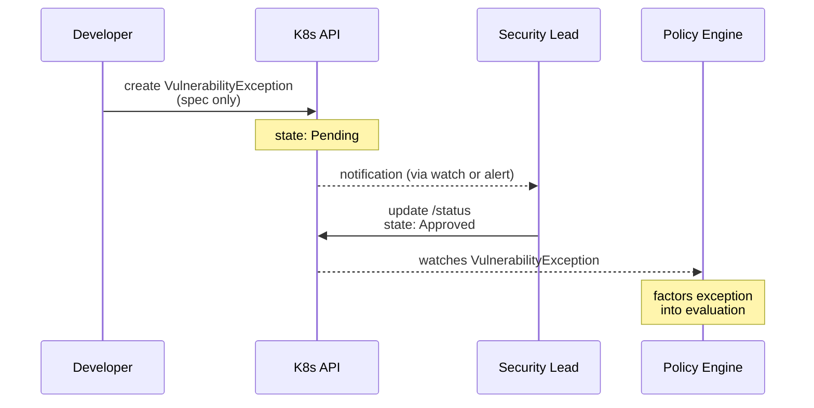

# CRD Design

*Part of [ACS Next Architecture](./)*

---

ACS Next is CRD-first. Configuration, credentials, policies, and security data are all represented as Kubernetes Custom Resources.

## Design Principles

1. **Separate CRDs for shared concerns** — Registries, notifiers, and other shared configurations are standalone CRDs, not inline in component specs
2. **Credentials via K8s Secrets** — Delegate to the platform; credential management has matured since StackRox was created
3. **Components watch configuration CRDs** — Scanner watches ImageRegistry CRs, Notifiers watch Notifier CRs, etc.
4. **Status subresource for workflows** — Approval workflows use `/status` subresource with separate RBAC
5. **Output CRs per image** — CR count scales with unique images, not CVEs; full vs summary data TBD (etcd size limits need validation)

## Credential Management

Kubernetes credential management has matured significantly since StackRox was created. ACS Next delegates to the platform rather than reimplementing storage and rotation:

| Approach | Use Case |
|----------|----------|
| Manual `kubectl create secret` | Simple, low-scale |
| External Secrets Operator | Vault, AWS Secrets Manager, Azure Key Vault, GCP Secret Manager |
| Sealed Secrets | GitOps with encrypted secrets in repo |
| CSI Secret Store Driver | Mount secrets without K8s Secret objects |
| IRSA / Workload Identity | Cloud-native (no static credentials for cloud services) |

## Configuration CRDs

### ImageRegistry

Defines a container registry that Scanner can pull from:

```yaml
apiVersion: acs.openshift.io/v1
kind: ImageRegistry
metadata:
  name: ecr-prod
  labels:
    env: production
spec:
  type: ecr  # ecr, gcr, acr, quay, docker, generic
  endpoint: 123456789.dkr.ecr.us-east-1.amazonaws.com
  credentialsRef:
    name: ecr-creds
    key: config.json
  # Alternative: use workload identity (no credentials)
  # useWorkloadIdentity: true
```

Scanner watches all ImageRegistry CRs in the cluster.

### Notifier

Defines a notification target:

```yaml
apiVersion: acs.openshift.io/v1
kind: Notifier
metadata:
  name: slack-security
  labels:
    severity: critical
spec:
  type: slack  # slack, teams, pagerduty, jira, splunk, webhook, etc.
  slack:
    webhookRef:
      name: slack-webhook
      key: url
    channel: "#security-alerts"
---
apiVersion: acs.openshift.io/v1
kind: Notifier
metadata:
  name: jira-security
  labels:
    severity: critical
spec:
  type: jira
  jira:
    url: https://company.atlassian.net
    project: SEC
    credentialsRef:
      name: jira-creds
```

Policies reference notifiers by name or label selector:

```yaml
apiVersion: acs.openshift.io/v1
kind: SecurityPolicy
spec:
  name: no-privileged-containers
  severity: High
  # Option 1: explicit references
  notifierRefs:
    - slack-security
    - jira-security
  # Option 2: label selector (notify all matching)
  notifierSelector:
    matchLabels:
      severity: critical
```

### VulnerabilityException

Supports approval workflow via status subresource:

```yaml
apiVersion: acs.openshift.io/v1
kind: VulnerabilityException
metadata:
  name: cve-2024-1234-nginx
spec:
  # Requester sets spec (requires vulnerabilityexceptions create/update)
  cves:
    - CVE-2024-1234
  scope:
    images:
      - "registry.example.com/nginx:*"
  expiration:
    type: time
    until: "2026-06-01"
  reason: "Mitigated by network policy; patch not yet available"
status:
  # Approver sets status (requires vulnerabilityexceptions/status update)
  approval:
    state: Approved  # Pending, Approved, Denied
    approvedBy: security-team@example.com
    timestamp: "2026-02-27T10:00:00Z"
    comment: "Reviewed; network isolation confirmed"
```

**RBAC:**
* `vulnerabilityexceptions` (create/update) → developers, requesters
* `vulnerabilityexceptions/status` (update) → security approvers only



## Output CRDs (Created by Components)

These CRDs are created by ACS components to expose security data.

**Full vs summary data:** Could be configurable. Full CVE data in CRs
simplifies the architecture (no drill-down API needed) but lowers the
ceiling on image/CVE counts before hitting etcd limits (~1MB per object).
Summary-only CRs scale further but require a separate drill-down mechanism.

### PolicyViolation

Created by CRD Projector when policies are violated:

```yaml
apiVersion: acs.openshift.io/v1
kind: PolicyViolation
metadata:
  name: deploy-nginx-privileged-abc123
  namespace: production
  labels:
    policy: no-privileged-containers
    severity: high
    resource-kind: Deployment
    resource-name: nginx
spec:
  policy: no-privileged-containers
  resource:
    kind: Deployment
    name: nginx
    namespace: production
  violations:
    - message: "Container 'nginx' is running as privileged"
      container: nginx
status:
  state: Active
  firstSeen: "2026-02-27T10:30:00Z"
  lastSeen: "2026-02-27T10:30:00Z"
```

### ImageScanSummary

Created by CRD Projector with summary-level vulnerability counts:

```yaml
apiVersion: acs.openshift.io/v1
kind: ImageScanSummary
metadata:
  name: sha256-abc123
  labels:
    image: registry.example.com/nginx
spec:
  image: registry.example.com/nginx@sha256:abc123
  lastScanned: "2026-03-10T10:00:00Z"
  summary:
    critical: 2
    high: 5
    medium: 12
    low: 23
  topCVEs:
    - cve: CVE-2024-1234
      severity: Critical
      component: openssl
      fixedIn: "1.1.1t"
    - cve: CVE-2024-5678
      severity: Critical
      component: curl
      fixedIn: "8.5.0"
status:
  affectedDeployments:
    - namespace: production
      name: nginx
    - namespace: staging
      name: nginx
```

**Note:** Whether CRs contain full CVE lists or just summaries with
drill-down is TBD. Depends on typical image CVE counts vs etcd limits.

### NodeVulnerability

Created by CRD Projector for node/host vulnerability data:

```yaml
apiVersion: acs.openshift.io/v1
kind: NodeVulnerability
metadata:
  name: node1-cve-2024-5678
  labels:
    node: node1
    severity: high
spec:
  node: node1
  cve: CVE-2024-5678
  severity: High
  cvss: 7.5
  component: openssl
  version: "1.1.1k"
  fixedIn: "1.1.1t"
status:
  nodeInfo:
    os: "Red Hat Enterprise Linux CoreOS"
    kernelVersion: "5.14.0-284.30.1.el9_2.x86_64"
```

**Node scanning flow:**
1. Collector (DaemonSet) scans host filesystem for installed packages
2. Collector publishes `node-index` to broker
3. Scanner matcher receives node index, matches against vulnerability DB
4. Scanner publishes node vulnerabilities to `vulnerabilities` feed
5. CRD Projector creates `NodeVulnerability` CRs

## CRD Inventory

| CRD | Category | Owner/Controller | Purpose |
|-----|----------|------------------|---------|
| **Installation** | | | |
| `ACSSecuredCluster` | Config | Top-level operator | Installation profile, component selection |
| `Scanner` | Config | Scanner operator | Scanner deployment configuration |
| `Collector` | Config | Collector operator | Collector deployment configuration |
| `Broker` | Config | Broker operator | Event hub configuration |
| **Configuration** | | | |
| `ImageRegistry` | Config | Scanner (watches) | Container registry credentials |
| `Notifier` | Config | Notifiers (watches) | Notification target credentials |
| `SignatureVerifier` | Config | Admission Control (watches) | Cosign/Sigstore public keys |
| `ReportConfiguration` | Config | Vuln Management Service (watches) | Scheduled report configuration |
| **Policies** | | | |
| `SecurityPolicy` | Policy | Policy engine (embedded) | Security policy definitions |
| `VulnerabilityException` | Policy | Scanner, CRD Projector | Exception with approval workflow |
| `NetworkBaseline` | Policy | Baselines | Learned network patterns |
| `ProcessBaseline` | Policy | Baselines | Learned process patterns |
| **Output** | | | |
| `PolicyViolation` | Output | CRD Projector (creates) | Active policy violations |
| `ImageScanSummary` | Output | CRD Projector (creates) | Image vulnerability summary (counts + top CVEs) |
| `NodeVulnerability` | Output | CRD Projector (creates) | Node/host vulnerability records |
| `BaselineAnomaly` | Output | Baselines (creates) | Detected anomalies |

*Note: Risk scores are stored as annotations on Deployments, not as separate CRs.*

## Fleet Distribution

ACM Governance distributes configuration CRDs fleet-wide:

```yaml
apiVersion: policy.open-cluster-management.io/v1
kind: Policy
metadata:
  name: security-registries
spec:
  remediationAction: enforce
  policy-templates:
    - objectDefinition:
        apiVersion: acs.openshift.io/v1
        kind: ImageRegistry
        metadata:
          name: corporate-registry
        spec:
          type: quay
          endpoint: quay.example.com
          credentialsRef:
            name: quay-creds
```

This enables:
* Consistent registry configuration across fleet
* Centralized notifier management
* Policy distribution (SecurityPolicy CRDs)
* Exception distribution (for fleet-wide exceptions)
