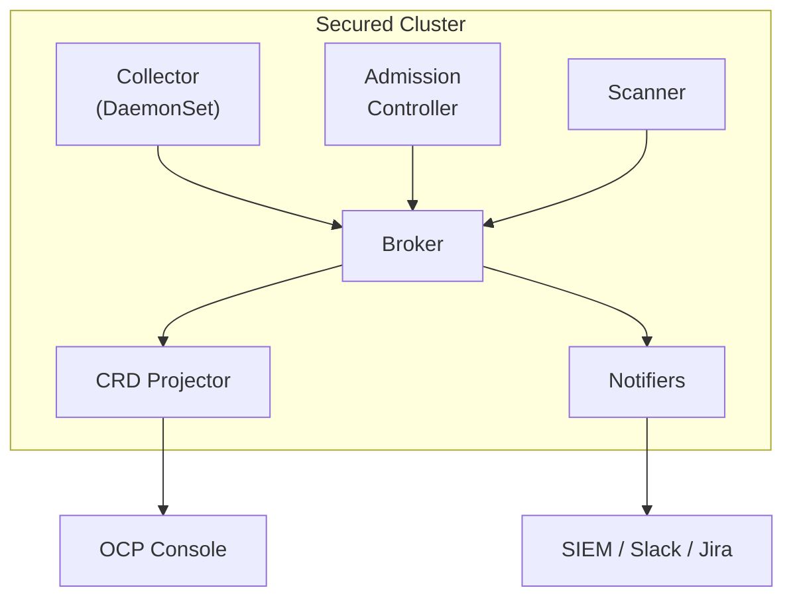
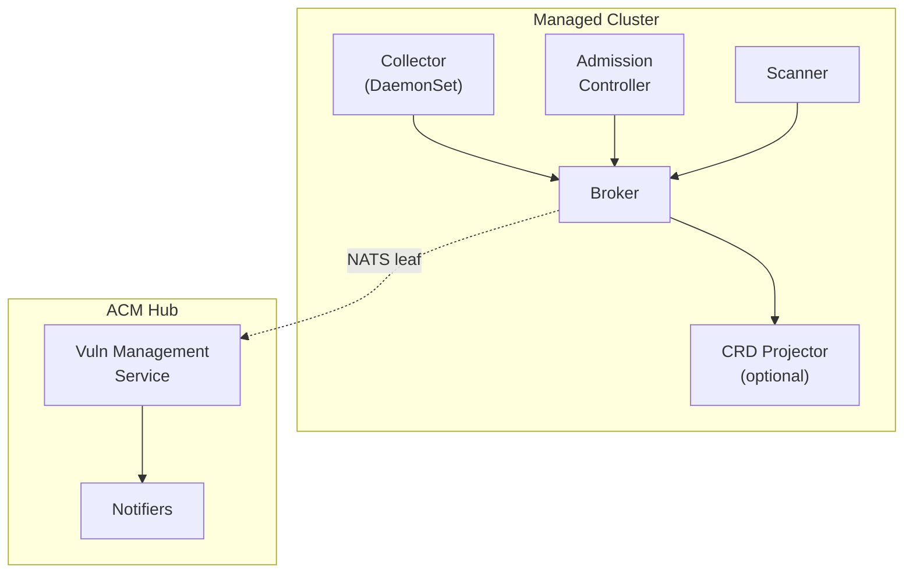
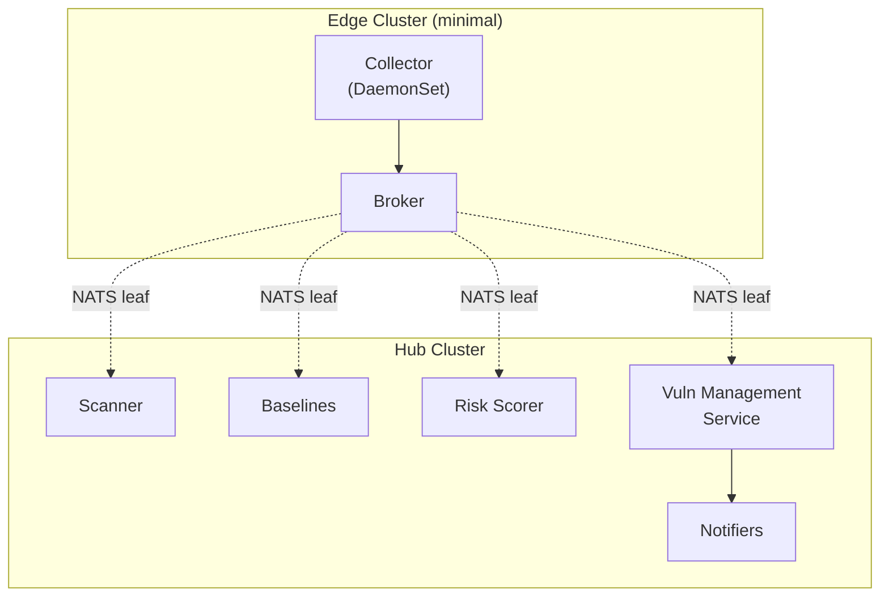

# Deployment Profiles

*Part of [ACS Next Architecture](./)*

---

ACS Next supports flexible deployment profiles. The decoupled architecture allows components to run where they make sense — all on-cluster, split between cluster and hub, or minimal on-cluster with everything else centralized.

## Standalone Cluster

Single cluster deployment without ACM. All components run on-cluster.

## ACM-Managed Cluster

Cluster managed by ACM hub. Core components on-cluster, fleet queries on hub.

## Edge Cluster (Minimal)

Resource-constrained edge cluster. Only data collection on-cluster; processing on hub.

## Component Placement

| Component | On Secured Cluster | On Hub | Notes |
|-----------|-------------------|--------|-------|
| Collector | Required | - | Must run where workloads run |
| Admission Control | Required | - | Must intercept local API calls |
| Broker | Required | - | Aggregates local events |
| Scanner (indexer) | ✓ | ✓ | Can split indexer/matcher |
| Scanner (matcher) | ✓ | ✓ | Heavy; often better on hub |
| Risk Scorer | ✓ | ✓ | Can run either place |
| Baselines | ✓ | ✓ | Can run either place |
| CRD Projector | ✓ | - | Enables local OCP Console visibility |
| Vuln Management Service | ✓ | ✓ | Fleet queries; typically on hub |
