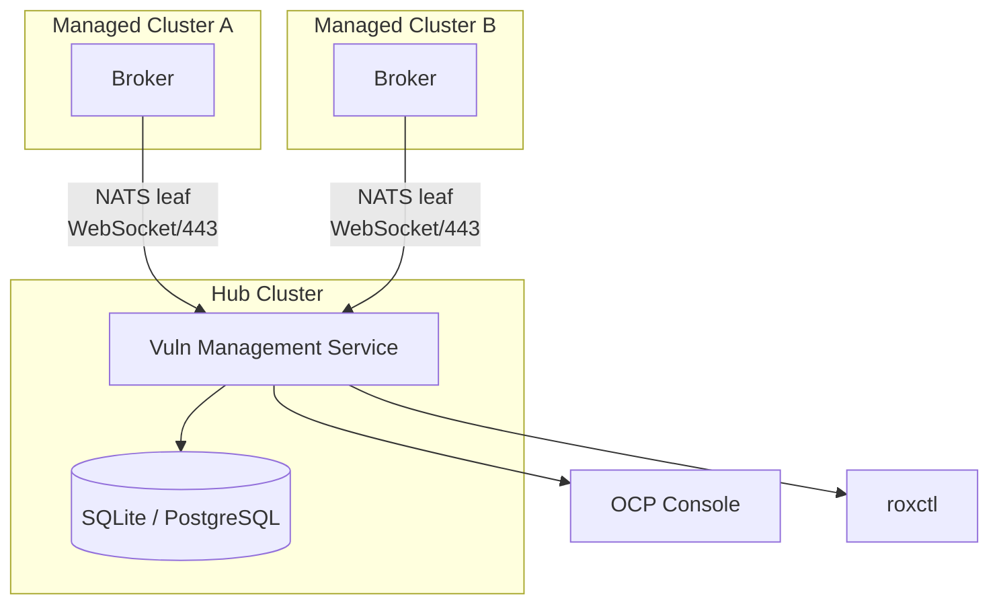

# Multi-Cluster Architecture

*Part of [ACS Next Architecture](./)*

---

ACS Next supports multi-cluster deployments via a hub-spoke model. Managed
clusters run ACS components locally (Collector, Scanner, Broker), and
security data streams to a hub for fleet-wide visibility.



**Primary multi-cluster use cases:**

* **Trends** — Prometheus metrics aggregated across clusters (Thanos/ACM
  Observability) for dashboards and alerting
* **Summaries** — Aggregated CRs for quick Console visibility
* **Deep queries** — [Vuln Management Service](components/vuln-management.md)
  for specific questions ("which images have CVE-X across the fleet")

## Cross-Cluster Data Transport

Security data streams from managed clusters to the hub via
[NATS leaf nodes](https://docs.nats.io/running-a-nats-service/configuration/leafnodes)
over WebSocket (port 443). This is a direct connection between the managed
cluster's broker and the hub's Vuln Management Service.

### Why Not Tunnel Over ACM?

ACM's [cluster-proxy](https://open-cluster-management.io/docs/getting-started/integration/cluster-proxy/)
(konnectivity) provides tunnels between hub and managed clusters. Tunneling
NATS over this infrastructure would:

* **Reuse ACM's network path** — no additional firewall rules
* **Strengthen the "built on ACM" story** — single integration point
* **Leverage ACM's mTLS** — unified certificate management

However, cluster-proxy has ~50% performance overhead and NATS-over-konnectivity
is not yet validated. More importantly, requiring ACM for multi-cluster ACS
creates adoption friction.

### Customer Reality

| Customer Segment | ACM Status | Direct NATS | Requires ACM |
|------------------|------------|-------------|--------------|
| OPP, actively uses ACM | Deployed | ✓ Works | ✓ Works |
| OPP, owns but doesn't use ACM | Licensed, not deployed | ✓ Works | ✗ Forces adoption |
| Non-OPP / upstream | No ACM | ✓ Works | ✗ Blocked |

Many OPP customers have purchased ACM but don't actively use it. Requiring ACM
for ACS Next multi-cluster would either delay adoption or force customers to
deploy infrastructure they've chosen not to use.

### Trade-offs

| Consideration | Direct NATS (WebSocket/443) | Via ACM/konnectivity |
|---------------|----------------------------|----------------------|
| Firewall | Standard HTTPS port | Reuses existing |
| Portfolio story | Separate data plane | "Built on ACM" |
| "ACS doesn't manage infra" | Delegates to NATS | Delegates to ACM |
| Performance | Native streaming | ~50% overhead |
| Non-ACM deployments | ✓ Supported | ✗ Blocked |
| Maturity | Production-ready | Needs validation |

### Decision

**Default: Direct NATS leaf nodes over WebSocket (port 443).**

This avoids a hard ACM dependency, works for all customer segments, and
uses proven NATS infrastructure. We're delegating to NATS rather than
building custom sync — consistent with the "delegate to mature systems"
principle.

**Future optimization:** For customers with active ACM deployments,
tunneling over konnectivity could reduce connection count. This requires
validation with the ACM team and is not a launch requirement.

---

## Fleet-Level RBAC

### Design Principle

**Fleet level: cluster-scoped RBAC. Cluster level: namespace-scoped RBAC.**

Two clean models at two levels. No cross-product. No identity mapping.
No custom RBAC engine.

### How It Works

The Vuln Management Service filters query results by the user's cluster
access:

```
User queries Vuln Management Service
    |
    +-- Service checks: "Which ManagedClusters (or ManagedClusterSets)
    |   does this user have access to?"
    |   (SubjectAccessReview or ACM RBAC API -- needs validation)
    |
    +-- Filters results to only those clusters
    |
    +-- Returns cluster-scoped results
```

| Persona | Fleet view scope | Mechanism |
|---------|------------------|-----------|
| Security Lead / Fleet Admin | All clusters | Full ManagedCluster access |
| Team Lead | Their team's clusters | ManagedClusterSet binding |
| Developer | **Does not use fleet view** | Uses single-cluster Console with K8s RBAC |

### Why Not Namespace-Level RBAC at Fleet Level

Namespace-level filtering at the fleet level — "user sees namespace A from
cluster 1 and namespace B from cluster 2" — reintroduces the RBAC
complexity that makes the current architecture unmaintainable:

* The hub would need to know every user's namespace-level permissions on
  every managed cluster
* This requires either syncing all RoleBindings to the hub (Central's SAC
  engine) or making SubjectAccessReview calls to remote clusters per query
  (latency and availability issues)
* ACM does not model namespace-level permissions on managed clusters —
  ACM RBAC operates at the ManagedCluster / ManagedClusterSet level

**The right UX model:** Fleet personas (security leads, team leads) operate
at cluster granularity. Namespace personas (developers) use the
single-cluster Console where K8s RBAC scopes naturally. These are different
tools for different jobs. Forcing the fleet view to also be a namespace
view creates complexity without proportional user value.

**Compared to current ACS:** Current ACS has fine-grained multi-cluster
RBAC (SAC engine with cluster x namespace x resource type x access level).
It's complex to configure, hard to reason about, and most customers end
up with a handful of broad roles anyway. ACS Next replaces this with two
familiar models that require zero custom RBAC configuration.

### Open Question: ACM RBAC Validation

**Needs validation with the ACM team:**

1. Does ACM Search filter results by ManagedClusterSet RBAC? If a user
   only has access to ManagedClusterSet `prod-east`, does ACM Search
   only return CRs from clusters in that set?

2. Does this extend to custom resources indexed from managed clusters?

3. Is there an API the Vuln Management Service can call — "given this
   user, which clusters can they see?" — so we can filter query results
   without reimplementing ACM's RBAC logic?

4. How do ManagedClusterSetBindings interact with addon data visibility?

---

## Compliance Operator Integration

**Decision**: Compliance operator integration is dissolved in ACS Next.

* Compliance operator management moves directly into OCP Console
* ACS no longer wraps or proxies compliance operator functionality
* Security policies (ACS) and compliance policies (compliance-operator) are separate concerns
* Users configure compliance operator directly; results visible in OCP Console

This simplifies ACS Next scope and avoids duplicating OCP-native compliance tooling.
